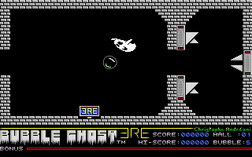
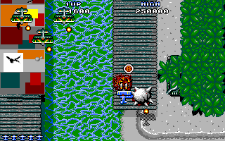
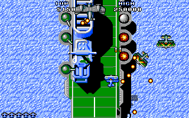

# Atari ST — from binary to remaster

Recovering lost 1980s Atari ST games from their shipped executables: disassemble one, name every
function, rewrite it as readable C **proven byte-for-byte against the original machine code**, and
run that C back on a 68000. The tooling and the [documentation](docs/README.md) are game-agnostic —
point them at any GEMDOS `.PRG`. **Four games are solved with them**, a fifth is reconstructed
and waiting on hardware, and a sixth is under way.
Every picture below was **drawn by the reconstruction**, not screenshotted from the original.

> **No game data is distributed here.** No `.PRG`, no data file, no disk image, no TOS ROM. Bring
> your own copy; see [Credits & legal](#credits--legal).

---

## The games

### Buggy Boy (Elite Systems, 1988) — the reference, taken all the way to a remaster

| In race, leg `NORTH` | Leg board |
|:---:|:---:|
|  |  |

Solved end to end and taken one stage further into a free, optimized remaster that is
**pixel-identical** to what the original drew. **91/91 functions verified · 81 test modules** · a
playable `BUGGYBOY.PRG` with sound, on Hatari and on a real ST/STE.
→ [`projects/buggyboy/README.md`](projects/buggyboy/README.md)

### Joust (Atari Corporation) — the proof the method is not shaped around the first game

| Title screen | The pterodactyl arrives |
|:---:|:---:|
|  |  |

Compiled C rather than hand-written assembly, and shipped packed — the one thing that needed new
tooling. **75/75 functions verified · 4368 differential tests** · a playable `JOUST.PRG` pinned
against the shipped binary frame by frame under Hatari. No remaster.
→ [`projects/joust/README.md`](projects/joust/README.md)

### Wonder Boy in Monsterland (Activision/Sega, 1989) — the first to boot a real machine

| Title | Stage 1, being played |
|:---:|:---:|
|  |  |

Taken from original, uncracked disks, and a game that drives the floppy controller itself.
**330 functions verified · 6465 differential tests** · a `.PRG` that boots a **real STE from its own
720 KB floppy**, where the machine found two defects every emulated surface had been green on.
→ [`projects/wonderboy/README.md`](projects/wonderboy/README.md)

### Zynaps (Hewson, 1988) — the one that runs at speed

| Title | Section 1, being played |
|:---:|:---:|
|  |  |

Begins at the flux of the user's own floppy. **217 verified ranges · 4751 tests** · a
`ZYNAPS.PRG` that plays **byte-identical to the shipped 1988 binary** at every sampled frame, at
**19.8 frames a second** thanks to hand-written 68000 twins, and STE-confirmed playable.
→ [`projects/zynaps/README.md`](projects/zynaps/README.md)

### Bubble Ghost (ERE Informatique 1987 / Accolade 1988) — the one wrapped in a cipher

| The presentation screen | Room 1, replaying the built-in demo |
|:---:|:---:|
|  |  |

Its `.PRG` is not crunched but *encrypted*, keyed by a CRC of the disk's protection track, so the
check cannot be patched out — the 16-bit key fell to an exhaustive search, the program now decrypts
**statically**, and the protection itself passes under Hatari from an original disk. **132 of 134
functions named, all 132 verified byte-for-byte · 1,909 tests** · a `BUBBLE.PRG` whose menu is
byte-identical to the original's at the same instruction and which **runs at the original's speed:
17.1 frames a second against 17.2**, on hand-written 68000 twins for the GEM door and the sound
tick. Play-tested from its floppy image by a person (2026-09-06) — the game is mouse-driven and no
headless check can reach that. What is left is **iron**, and `GHOST.LOA`, a second program it calls.
→ [`projects/bubbleghost/README.md`](projects/bubbleghost/README.md)

### Flying Shark (Taito 1987 / Firebird 1988) — the one still being written

| The river, level 1 | Over the carrier, level 2 |
|:---:|:---:|
|  |  |

A vertically-scrolling shooter, taken out of a Gamex hard-disk release where the game is a packed
stream inside a stub that fakes GEMDOS. **254 functions named · ten of ten subsystems verified ·
277 verified rows across 3,553 differential tests** — all forty-five calls of the frame loop are
reconstructed C, and the two frames above were drawn by one call into it per frame — as is the whole
gallery, four stages of it, each staged by the reconstruction's own cores. The same cores compiled
for the 68000 are a playable `FLYSHARK.PRG` and a bootable `.ST`, byte-identical to the original's
attract frames at 13.9 fps against its 12.5 — untested under a real stick and on iron.
→ [`projects/flyingshark/README.md`](projects/flyingshark/README.md)

---

## The three stages

```
   GAME.PRG                                   ── the shipped binary (you supply it)
        │
        │  tools/prg_dis.py · Ghidra headless · names.txt naming loop
        ▼
1. DISASSEMBLE & NAME     decomp.c — every function named, anchored on OS traps + hardware regs
        │
        │  rewrite as idiomatic C, then diff every function against a cycle-accurate 68000
        ▼
2. RECREATE               recreate/ — readable C, each function byte-for-byte == the original
        │                            (oracle: Musashi running the real machine code)
        │  rewrite freely for speed and clarity; the only rule is the frame must not change
        ▼
3. REMASTER               remaster/ — native structs, faster algorithms, pixel-identical output
        │
        ▼
   GAME.PRG on a 68000                        ── cross-compiled back to m68k
```

Each stage is refereed by the one above it, so nothing can go wrong quietly. Stage 2 is judged by a
cycle-accurate emulator running the original machine code; stage 3 is judged, frame by frame,
against stage 2's verified cores. Only Buggy Boy has a stage 3; the others go from stage 2
straight onto the 68000. Each game's README tells its own story.

## Quick start

**Prerequisites:** Ghidra 12 (scripts are Java — Ghidra 12 dropped Jython), JDK 21, Python 3.10+,
a C compiler, and the Hatari emulator plus your own TOS ROM for on-target runs.

```bash
# reverse a binary of your own
bash tools/new_project.sh mygame path/to/GAME.PRG   # scaffold projects/mygame/
bash projects/mygame/run.sh                         # import → analyze → annotate → decomp.c
#  read decomp.c → append to names.txt → reapply → re-read
bash projects/mygame/reapply.sh

# reproduce a solved game (needs your own game files under projects/<game>/bin/)
cd projects/<game>/recreate
make venv && make test          # builds the Musashi oracle + the C cores, runs the differential suite
                                # (zynaps also needs m68k-elf-gcc: its 68000 twins are assembled first)
```

Each game's README has its own build, render and play commands beyond that — the remaster, the
on-target `.PRG`, the bootable floppy, the frame differential against the shipped binary.

## Repo layout

```
reverse/
├── docs/                     transferable knowledge, one file per expertise domain
├── tools/                    game-agnostic tooling
│   ├── prg_dis.py            GEMDOS .PRG analyzer + 68000 first-pass disassembler
│   ├── extract_graphics.py   ST 4-plane / RLE graphics → PNG
│   ├── depack_gamex.py       static depacker for the Gamex/"PP" LZSS cruncher
│   ├── depack_lsd.py         static depacker for the "LSD!" backwards-LZ cruncher
│   ├── depack_bubbleghost.py static decrypter for Bubble Ghost's protection-keyed cipher
│   ├── ghidra_scripts/       PrgLoader · LineAResolve · SeedFunctions · AtariOsTrapAnnotate ·
│                             ExportDecompC · ApplyNames · …
│   ├── hw_portability.py     how much of a game a memory-only differential can verify
│   ├── headless.sh           bootstrap: import → load → resolve Line-A → analyze →
│                             seed orphan code → annotate → export
│   ├── reapply.sh            fast naming loop: apply names.txt → re-export
│   ├── hw_scan.sh            dump bodies + call graph + hardware accesses → TSV
│   ├── hatari_run.sh         run a game in Hatari (unpack in-place, then dump memory)
│   ├── new_project.sh        scaffold projects/<name>/
│   └── recreate_kit/         shared differential harness: PRG loader, Musashi oracle,
│                             TOS traps — bound to a game by its recreate/project.toml
└── projects/                 one directory per reversed game, scaffolded by new_project.sh
    ├── bubbleghost/          names.txt · decomp.c · recreate/ · notes/ · tools/
    ├── flyingshark/          names.txt · decomp.c · recreate/ · notes/ · tools/
    ├── buggyboy/             names.txt · decomp.c · recreate/ · remaster/ (the playable PRG) · docs/
    ├── joust/                names.txt · decomp.c · recreate/ (+ atari/ — the playable PRG)
    ├── wonderboy/            names.txt · decomp.c · recreate/ (+ atari/ — the PRG and its floppy) ·
    │                         notes/ · tools/
    └── zynaps/               names.txt · decomp.c · recreate/ (+ atari/ — the PRG and its floppy,
                              src/asm/ — the 68000 twins) · tools/
```

## Documentation

Thirteen domain guides, each grounded in real evidence from the four solved games but written as
general procedure.
Start with [`docs/00-overview.md`](docs/00-overview.md) for the end-to-end workflow and a "what kind
of file is this?" decision tree, then [`docs/agent-playbook.md`](docs/agent-playbook.md) for the
verification loop that ties the rest together. Full index: [`docs/README.md`](docs/README.md).

| | |
|---|---|
| [binary-formats](docs/binary-formats.md) | parse a `.PRG`/`.TOS`/`.TTP`, its header, symbols, relocations |
| [packed-executables](docs/packed-executables.md) | the entry is garbage — depack via Hatari before analyzing |
| [m68k-disassembly](docs/m68k-disassembly.md) | read 68000 asm, avoid sweep desync, spot jump tables |
| [ghidra-pipeline](docs/ghidra-pipeline.md) · [ghidra-gui](docs/ghidra-gui.md) | drive Ghidra headless, then explore interactively |
| [tos-os-calls](docs/tos-os-calls.md) | GEMDOS/BIOS/XBIOS/GEM calls and Line-A `$aXXX`, basepage, loaders |
| [hardware-map](docs/hardware-map.md) | video/sound/MFP/IKBD registers, interrupts |
| [graphics](docs/graphics.md) · [sound](docs/sound.md) | planar bitmaps, palettes, RLE; the YM2149 driver |
| [on-target-execution](docs/on-target-execution.md) | run the verified reconstruction on real hardware |
| [methodology](docs/methodology.md) | actually name things: anchors → outward, verify, iterate |

## Use it on another binary

Nothing above is game specific except the per-game directories under `projects/`. `new_project.sh`
scaffolds a new target, the Ghidra scripts and the naming loop work on any GEMDOS executable, and
the differential harness is a shared component rather than a pattern to copy:
[`tools/recreate_kit/`](tools/recreate_kit/README.md) takes the entry addresses and the memory image
from a `project.toml`, and a game opts into its extra models (file-load seam, scheduled writes,
seeded hardware reads, hardware-write ledger) the same way — each game's README says which and why.
If the entry point disassembles to garbage the binary is packed:
[`docs/packed-executables.md`](docs/packed-executables.md). If it barely uses the OS at all, check
where it really runs: [`docs/binary-formats.md`](docs/binary-formats.md).

## Credits & legal

**Buggy Boy** for the Atari ST — *program and graphics by Martin W. Ward, sonics by Jas. C. Brooke*
(both credited on the game's own intermission screen, reproduced in its project README), published
by Elite Systems International, 1988 (per the copyright string in the binary itself). All rights in
the game belong to their respective owners.

**Joust** for the Atari ST — the title screen the reconstruction draws above is the binary's own
credit, verbatim: *"PRESENTED BY ATARI CORPORATION"* and *"COPYRIGHT 1985 BY THE RUGBY CIRCLE,
INC."*, the two strings `title_screen` reads out of the program image at `0x183d5`. Joust itself is
Williams Electronics' 1982 coin-op, of which this is a licensed home conversion; the copy analysed
here is the later Gamex release, whose own `README.TXT` is signed "PP". All rights in the game and
in the arcade original belong to their respective owners.

**Wonder Boy in Monsterland** for the Atari ST — the binary carries no copyright string at all, so
the credit reproduced here is the game's own credits screen, drawn by the reconstruction in its
project README and transcribed verbatim: *"WONDERBOY IN MONSTERLAND / 1987 SEGA / WESTONE. / ALL
RIGHTS RESERVED. / ACTIVISION.AUTHORISED USER. / CONVERSION BY IMAGES DESIGN. / GRAPHICS - JASON
LIHOU, ANDREW PANG / MUSIC - DAVID WHITTAKER / PROGRAM - LAURA.P.PAUL."*, over the SEGA and
ActiVision logos and the line *"A SOFTWARE STUDIOS PRODUCTION"*. `names.txt`'s own header dates the
release to Activision/Sega, 1989. The arcade original is Westone and Sega's 1987 *Wonder Boy in
Monster Land*, of which this is a licensed home conversion. All rights in the game and in the
arcade original belong to their respective owners.

**Zynaps** for the Atari ST — the credits reproduced here are the game's own title page, drawn by
the reconstruction above and transcribed verbatim: *"CONVERTED BY MICROWISH / CODING : HOWIE /
GRAPHICS : PETE LYON / MUSIC AND SOUND FX : J.DAVE ROGERS"*, under the ZYNAPS and HEWSON logos. The
game was written by Dominic Robinson and published by Hewson Consultants for the Spectrum and C64 in
1987; this is the 1988 ST conversion. All rights in the game belong to their respective owners.

**Bubble Ghost** for the Atari ST — the credit reproduced here is the game's own title picture,
decoded from `GHOST.PRE` and shown above: the BUBBLE GHOST logo, *by C.Andreani*, and *Copyright
1988, ACCOLADE INC. TM*. Published by ERE Informatique in 1987 and by Accolade in 1988. All rights
in the game belong to their respective owners.

**Flying Shark** for the Atari ST — the credit reproduced here is the binary's own string,
verbatim: *"PROGRAMMING BY PRIME SOFTWARE & IMAGES DESIGN"*, and the game's attract screen adds
*"PROGRAMMING BY HENRY S CLARK AND KARL D JEFFERY / GRAPHICS BY JASON G LIHOU / SOUND BY
J C BROOKE"*. *Flying Shark* is Taito's 1987 coin-op; this is the licensed Atari ST conversion
published by Firebird in 1988, and the copy analysed here is the later Gamex hard-disk release,
whose own `README.TXT` is signed "PP". All rights in the game and in the arcade original belong to
their respective owners.

This repository contains **no game code or data** — no executable, no `COURSES.DAT`, no
`GRAPHICS.GRA`, no `JOUST.PRG`, no `JOUSTS.CTE`, no `HIGH.SCO`, no `SWB.PRG`, none of the `.RAD`
resources (`TITLESCR`, `CREDITS`, `DATADISK`, `TILEDATA` and the thirty-seven `OVALAY*` overlays),
no `SPRITES.CRU`, no `ZYNAPS17.PRG`, none of Zynaps' sixty-two data files, no `GHOST.PRG`, none of
Bubble Ghost's six data files, no `FSLA`, no `FRD`, no `FLYSHARK.PRG`, none of the twenty-one files
in Flying Shark's container, no flux or sector dump of any of these six games' floppies, no disk
image of any of them, and no TOS ROM image. It holds analysis, documentation, tooling, and
independently written C. The images in this repository's READMEs are output of that reconstruction —
except Bubble Ghost's two, which are its own artwork decoded from a data file and a screenshot of
the original binary running in an emulator (that game is reconstructed but has no playable build to
draw from yet), and Flying Shark's title picture, which is its own NEOchrome artwork as the game's
own loader places it. All are
included to document what the work produces; reproducing any of them at all requires the game files
this repository does not ship. Running any of it requires a copy of the game you already own.

Reverse engineering here is for interoperability, preservation and study.

**License.** The work in this repository — the tooling, the documentation and the reconstructed C —
is Copyright © 2026 Geoffrey Anneheim and released under the **GNU General Public License, version
2** ([`LICENSE`](LICENSE)). That covers this repository's own contents only; it grants no rights in
Buggy Boy, Joust, Wonder Boy in Monsterland, Zynaps, Bubble Ghost or Flying Shark, all of which
remain the property of their owners.
