# Atari ST — from binary to remaster

Recovering lost 1980s Atari ST games from their shipped executables: disassemble one, name every
function, rewrite it as readable C **proven byte-for-byte against the original machine code**, and
run that C back on a 68000. The tooling and the [documentation](docs/README.md) are game-agnostic —
point them at any GEMDOS `.PRG`. **Four games are solved with them.**

<p align="center">
  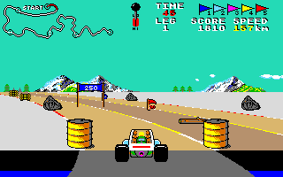
</p>

<p align="center"><em>Not a screenshot of the original program — this frame was drawn by the
reconstruction: its road rasterizer, scroll blitter, object dispatcher and HUD, over the game's own
<code>COURSES.DAT</code>.</em></p>

**Buggy Boy** (Elite Systems, 1988) is the worked reference, solved end to end and taken one stage
further into a free, optimized remaster that is **pixel-identical** to what the original drew:
**91/91 functions verified** · **~20 000 lines of reconstructed C** · **69 test modules** ·
**driveable on a 68000**.

**Joust** (published for the ST by Atari Corporation) is the second game, and the proof the method
is not shaped around the first: **75/75 functions verified** · **4368 differential tests** · a
playable `JOUST.PRG` cross-compiled back to m68k and pinned against the shipped binary frame by
frame. It stops at the proving stage — there is **no Joust remaster**. See
[The second game — Joust](#the-second-game--joust).

**Wonder Boy in Monsterland** (Activision/Sega, 1989) is the third, and the first taken from
original, uncracked disks rather than from a release someone had already stripped: **330 functions
verified** · **41,652 bytes of the original's machine code** · **6462 differential tests** · and a
`.PRG` that is the first thing in this repository to leave the emulator entirely. It boots a **real
4 MB STE from its own 720 KB floppy**, through TOS's `AUTO` folder, with no host in the machine —
and three sessions at that machine found two defects every emulated surface here had been green on.
See [The third game — Wonder Boy in Monsterland](#the-third-game--wonder-boy-in-monsterland).

**Zynaps** (Hewson, 1988) is the fourth, and the one that runs: **217 verified ranges — 189 whole
functions and 28 named slices of five that cannot be entered at their front door** · **4751 tests**
· and a `ZYNAPS.PRG` that boots, shows its attract screen, starts a game and plays a section
**byte-identical to the shipped 1988 binary at every sampled frame** — 32000 framebuffer bytes,
twenty entity records and sixteen colour registers, all three. Five waves of hand-written 68000
twins took it from 8.7 to **19.8 frames a second** against the original's 25, and it fits a 1 MB
machine with 310 KB to spare. See [The fourth game — Zynaps](#the-fourth-game--zynaps).

> **No game data is distributed here.** No `.PRG`, no `COURSES.DAT`, no `GRAPHICS.GRA`, no
> `HIGH.SCO`, no `ZYNAPS17.PRG`, no TOS ROM. Bring your own copy; see
> [Credits & legal](#credits--legal).

---

## The three stages

```
   BUGGYBOY.PRG                              ── the shipped 1988 binary (you supply it)
        │
        │  tools/prg_dis.py · Ghidra headless · names.txt naming loop
        ▼
1. DISASSEMBLE & NAME     decomp.c — 91 named functions, anchored on OS traps + hardware regs
        │
        │  rewrite as idiomatic C, then diff every function against a cycle-accurate 68000
        ▼
2. RECREATE               recreate/ — readable C, each function byte-for-byte == the original
        │                            (oracle: Musashi running the real machine code)
        │  rewrite freely for speed and clarity; the only rule is the frame must not change
        ▼
3. REMASTER               remaster/ — native structs, faster algorithms, pixel-identical output
        │
        ▼
   BUGGYBOY.PRG on a 68000                    ── cross-compiled back to m68k, runs under Hatari
```

Each stage is refereed by the one above it, so nothing can go wrong quietly. Stage 2 is judged by a
cycle-accurate emulator running the original machine code; stage 3 is judged, frame by frame,
against stage 2's verified cores.

Buggy Boy went through all three. Joust goes through the first two and then straight onto the
68000: same disassemble-and-name loop, same differential proof, same cross-compile back to a `.PRG`
— no stage 3. Wonder Boy takes the same two stages and then carries the `.PRG` one rung further
than either: not just onto the 68000 under an emulator, but onto a **real Atari STE, booted from a
720 KB floppy the build writes itself**, which is where the last two bugs were found. Zynaps takes
the first two and no third: there is no `zynaps/remaster/`, because what its `.PRG` needed was not
freedom to change the frame but **speed enough to play it** — hand-written 68000 twins for the hot
paths, each a faithful transcription of the original's own instructions and each pinned against the
C it replaces by the same differential.

---

## Gallery — Buggy Boy

Everything below was **rendered by the reconstruction**, then decoded from the Atari's 4-plane
framebuffer with the game's own palettes. Regenerate the whole set — byte-identical every run — with
`projects/buggyboy/gen_readme_assets.py`, run under `recreate/`'s venv.

### In-race frames — three courses, driven for real

Staged from the real course data, driven with the throttle held through the verified `game_update`,
then drawn by the verified render pipeline (road → scroll → objects → HUD).

| `OFFROAD` | `NORTH` | `SOUTH` |
|:---:|:---:|:---:|
|  |  | 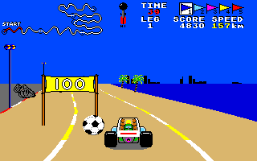 |

The course map in the top-left corner is built per leg by `init_leg_dash` out of `COURSES.DAT` and
blitted every frame by `draw_dashboard`; the trace along it is the player's live progress.

### Screens

| Credits | Leg board | High scores |
|:---:|:---:|:---:|
| 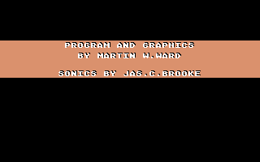 | 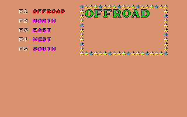 | 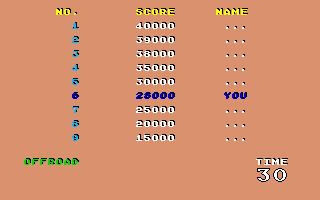 |

### Course data and sprites

`COURSES.DAT` turned out not to be a script but road-slice **bitmap** data, streamed eight bytes at a
time through a circular buffer. Walking it recovers each leg's shape:

| `OFFROAD` | `WEST` |
|:---:|:---:|
|  |  |

`GRAPHICS.GRA` is a sprite table plus an RLE stream that unpacks to eight 320×200 four-plane atlases:

| Gates & score markers | Roadside scenery |
|:---:|:---:|
|  | 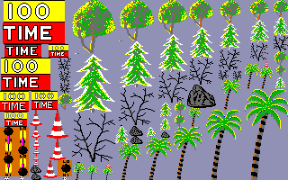 |

[`projects/buggyboy/docs/function_graph.html`](projects/buggyboy/docs/function_graph.html) is a
standalone call-graph explorer covering all 117 functions — open it in a browser, no server needed.
With your own copy of the game you can go further: `gen_assets.py` regenerates the full media set
(every sprite page, per-object crops sliced by driving the real blitter, buggy animations as GIFs,
and the soundtrack re-rendered through the reconstructed YM2149 driver), and re-running
`gen_graph.py` attaches all of it to the functions that produce it. Generated media is not stored
in this repository.

---

## Stage 1 — Disassemble & name

Load the `.PRG` at a known base, let Ghidra analyze, then iterate a plain-text name map until the
decompilation reads like source.

```bash
bash tools/new_project.sh mygame path/to/GAME.PRG   # scaffold projects/mygame/
bash projects/mygame/run.sh                         # import → analyze → annotate → decomp.c
#  read decomp.c → append to names.txt → reapply → re-read
bash projects/mygame/reapply.sh
```

`names.txt` is the source of truth — one directive per line, addressed as Ghidra sees them
(image offset + load base):

```
fn   0x1555e draw_hud
var  0x18c38 leg_index
cmt  0x1110e game_update: input, integrate throttle->speed, steering->road_curve, stream course…
```

The method is **anchors outward**: start from ground truth an emulator cannot dispute — GEMDOS/BIOS
trap numbers, DRI symbols, hardware register addresses, string literals — and propagate along the
call graph. Then *verify by reading the body*; several confident first guesses in this project were
wrong until someone actually read the code ([`docs/methodology.md`](docs/methodology.md)).

**Result for Buggy Boy:** 335 name directives, all 91 functions named, plus a decoded loader,
course format, sprite format, event jump table and sound driver.

## Stage 2 — Recreate: prove it

Buggy Boy was hand-written assembly, so there is no original source to recompile and byte-match
against. Instead we prove **behavioural equivalence**: run the real machine code and the
reconstruction on identical memory, then diff.

```
          initial memory image + registers
                     │
        ┌────────────┴─────────────┐
        ▼                          ▼
  ORACLE (real 68k)          CANDIDATE (our C)
  Musashi via liboracle.so   libbuggyboy.so via ctypes
        │                          │
        ▼                          ▼
  final memory + write-set   final memory
        └──────────► diff ◄────────┘   green = byte-for-byte identical
```

Both sides share one flat big-endian image whose indices are the game's real addresses. The harness
diffs the *whole* image, so a byte the original writes that the reconstruction misses fails the test.
Leaf functions can additionally opt into an attribution pass that poisons oracle-written bytes first,
so a candidate that matches *coincidentally* is caught rather than passing.

Functions that never return (`_start`, the interactive loops) are verified at a checkpoint PC, with
any excluded stack band vetted against the oracle's deepest stack pointer so an exclusion cannot hide
a divergence.

**Status: 91/91 verified.** See [`recreate/STATUS.md`](projects/buggyboy/recreate/STATUS.md) for the
per-function table and how each one was pinned.

## Stage 3 — Remaster: free it

`recreate/` proves what the original does. `remaster/` is free to look nothing like 68000 assembly —
native structs instead of a flat image, real types, precomputed tables, better algorithms — subject
to exactly one rule:

> For any given input, the remaster must produce a **pixel-identical framebuffer** to the verified
> `recreate/` cores, every frame.

The two use deliberately different memory layouts, so their internal state cannot be diffed. The one
surface they share is the thing the player sees, and that is the comparison surface. An optimization
that moves a single pixel fails.

- **Phase A — render pipeline: green.** Road geometry, rasterizer, scroll blitter, ground/horizon,
  sprites, scaled objects, the fine-x blit engines, the object-list dispatcher and all eight HUD
  phases are ported and byte-exact over the whole framebuffer.
- **Phase B — gameplay: in progress.** Course streaming, the object ring, player physics and the
  crash/auto-steer script are ported and frame-exact; sound, collision probing and event dispatch
  are not started.
- **On target:** `BUGGYBOY.PRG` — the playable game (no sound) — cross-compiles back to m68k and runs
  under Hatari, loading the unmodified `COURSES.DAT` and `GRAPHICS.GRA` at boot. It boots into the leg
  select; its leg-0 start frame is byte-identical to the reconstruction's, and it is driveable.

See [`remaster/STATUS.md`](projects/buggyboy/remaster/STATUS.md) for the per-subsystem table.

---

## The second game — Joust

Everything above is Buggy Boy. [`projects/joust/`](projects/joust/) is the same pipeline pointed at
a different binary — a different publisher, a different decade of tooling, and a compiler rather
than a human writing the assembly — and the point of it is how little had to move.

It starts one step earlier, because the game ships **packed**: `JOUSTS.CTE` has 6.95 bits of
entropy, no relocations and an entry that disassembles to garbage. `tools/depack_gamex.py` unpacks
it statically — the Gamex/"PP" LZSS algorithm read out of the release's own `START.TOS`, and
validated by self-depacking that loader — into an ordinary GEMDOS `bin/JOUST.PRG`: 114 KB, entropy
4.01, 1227 relocations, and from there the normal naming loop. That is the capability
[`docs/packed-executables.md`](docs/packed-executables.md) was written from.

The harness is now **shared**. [`tools/recreate_kit/`](tools/recreate_kit/README.md) owns the PRG
loader, the Musashi oracle and the TOS trap model; a game binds to it with a small `project.toml`
naming its binary, load base and image size, and everything else in `recreate/` is game-specific.

**Status: 75/75 functions verified · 4368 differential tests · no `# ctx` names left.** Being
compiled C rather than hand-written assembly cost one thing Buggy Boy never needed: most of Joust's
routines take their arguments on the **caller's stack**, and the differential deliberately stops
comparing at the stack. `recreate/test/abi.py` fixes that by poking a two-instruction 68000 stub
into free image space and entering the oracle there, so every argument block lands in ordinary,
fully diffed memory. Per-function notes, and every limit that is disclosed rather than closed, are
in [`recreate/STATUS.md`](projects/joust/recreate/STATUS.md).

**On target, three surfaces are compared rather than one.**
[`recreate/atari/`](projects/joust/recreate/atari/README.md) cross-compiles the same verified cores
to m68k and runs the result under Hatari **beside the shipped binary, on one emulator**. At six
sampled frames of real play — each chosen because its neighbour differs, so a one-frame mis-anchor
is detectable — the **32000 framebuffer bytes** are identical, and so are the **sixteen hardware
palette pens read back off the shifter**. Once more, at a frame from the static band, so is the
**rendered picture**: the emulator's own video output, the one artefact there that is not a memory
dump, and the only one that sees what the player sees. On EmuTOS and on TOS 1.04. The palette and
the picture each get their own injected-fault control, because the frame anchors structurally
cannot exercise either — that README is careful about what each check can and cannot see, and it
also records the three bugs that appear only on real hardware and the one fidelity gap (a register
hand-off no C `_start` can make) that is disclosed rather than papered over.

### Gallery — Joust

Rendered **host-side by the reconstruction**, with no emulator and no TOS ROM in the loop:
`projects/joust/gen_readme_assets.py` loads your own `JOUST.PRG` through the kit, drives the
verified cores over ctypes exactly as the tests do, and de-interleaves the framebuffer they paint
with the game's own palette words. Every picture is a function of the binary alone — the
high-score record staged is the blank one the `.PRG` itself carries, not the save file next to it
— so the whole set is byte-identical every run.

| Title screen | Wave 1 begins | A joust, and a loose egg |
|:---:|:---:|:---:|
| 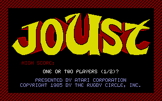 | 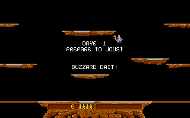 | 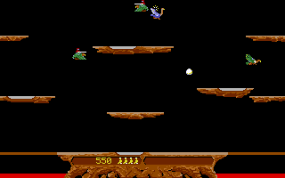 |

`init_system` takes the machine over and loads `HIGH.SCO`; `title_screen` then paints the picture
the `.PRG` itself carries, draws its three lines through `draw_string` — the middle one is the
`HIGH SCORE:` line the loaded record is spliced into, blank here because nobody has set one — and
runs one attract pass, which is what `cycle_palette` and the six-pen ring rotate the shown palette
by.

The two frames beside it are the game **playing itself**. `_start`'s init chain runs
(`init_game`, `init_video`), then laps of its frame loop, each lap driven through the two verified
rotated entries either side of the IKBD wait no run can cross — with the joysticks fed from a
seeded generator, because random input is what makes riders fight and eggs exist. Everything drawn
is the loop's own seventeen calls: `draw_platforms`, `render_objects`, `update_eggs`,
`draw_messages`, `collision_check`, `wave_manager` and the rest.

| The pterodactyl arrives | A new record, being typed | The cast |
|:---:|:---:|:---:|
| 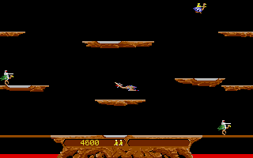 | 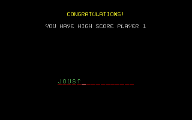 | 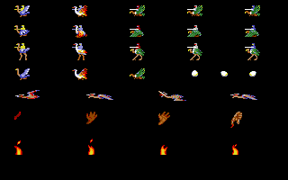 |

On lap 1850 of that same self-played game `update_pterodactyl` has the bird over the middle of the
playfield, drawn by `blit_mask_wide` and `blit_sprite_planes`. The middle picture ends the same
kind of run: the score it really earned beats the blank record, which is what `check_highscore`
reports when it puts the entry screen up, and `hiscore_key_input` then types the name one console
key per call. The one thing staged there is the last-life flag itself — bounded self-play cannot
reach a real game over, because the frame loop's own glue refuses a lap once the game is finished
and the record taken.

The last is a sheet of the game's own bitmaps, at their own addresses, drawn by the five routines
that draw them in play — only the destination is ours, plus one row count: the lava flames take
theirs from a ground-burn block that only a later wave ever arms, so a cold image has nothing to
read and the sheet supplies the height instead. `draw_object_data` lays out the five rider
sets in three poses plus the three unseated ones, `draw_egg_sprite` the three egg poses,
`blit_sprite_planes` the pterodactyl's four wing beats out of `ptero_frame_table`,
`troll_draw_hand` the lava troll's hand frames out of `troll_sprite_table`, and `blit_sprite` the
four lava flames. No two of them describe a sprite the same way — the rider and egg blitters take
an absolute destination and read `draw_shift`/`draw_rows` as **bytes**, the bird and the hand take
an offset from `screen_base` and read the same two addresses as **words** — which is a width clash
in the original, reproduced rather than tidied.

---

## The third game — Wonder Boy in Monsterland

[`projects/wonderboy/`](projects/wonderboy/) is the same pipeline pointed at a game that never
reaches an operating system. `AUTO/SWB.PRG` makes **one trap instruction in 136 KB** — a `Super` —
and drives the WD1772 floppy controller and the DMA chip itself, with its own FAT12 layer, because
the copy protection lives in sectors numbered outside the standard range that no OS call can
address. It also copies itself to the absolute address `$400` and lives there, so Ghidra recovers
57 functions at the workspace's default load base and 186 at the right one. Two original Pasti
`.stx` images go in; a solved resource cruncher, a decoded FAT12 filesystem and a named 68000
program come out.

**Four things had to move in the tooling, and three of them are now shared.** The kit gained a
**file-load seam**: a game whose boot chain bottoms out in a sector driver cuts it at the lowest
routine whose inputs are *file-shaped* — a name and a destination — and calls `disk_read_file`
across the cut, which is the staged-file model off target and real GEMDOS on it
([`TRAP_MODEL.md`](tools/recreate_kit/TRAP_MODEL.md)'s Phase 9). The **boot chain is composed from
slices** rather than ported as one routine, because the original cuts itself into four with fire
waits only an IKBD interrupt can end: `boot_title_screen`, `boot_credits_screen`, `boot_load_stage`
and `boot_prompt_screen`, each verified whole against the oracle across the seam. The port has
**one shifter sink** (`src/shifter.c`) — the screen base and the sixteen colour registers are off
the 68000's 24-bit bus as far as the loaded image goes, so every write to them meets in one file
with one on-target arm, and a build gate refuses a second copy of it. And `atari/mkprg.py`,
`tools/st_build.py`, [`atari/HARDWARE.md`](projects/wonderboy/recreate/atari/HARDWARE.md) and
`tools/assert_trap_registers.sh` are what turn the cross-compiled cores into a **bootable 720 KB
FAT12 floppy** and keep them safe on the way — that last one because TOS preserves fewer registers
across a trap than GCC's m68k ABI believes are callee-saved, which was three bombs in Buggy Boy.

**Status: 330 functions verified · 41,652 bytes of the original's machine code · 6462 differential
tests** (plus 392 in the shared kit), and the per-function table, every boundary and every limit
that is disclosed rather than closed are in
[`recreate/STATUS.md`](projects/wonderboy/recreate/STATUS.md). What the harness can and cannot see
is measured rather than asserted:
[`recreate/PORTABILITY.md`](projects/wonderboy/recreate/PORTABILITY.md) reports that **80.7 % of
the program's believed code is now inside the measurement**, and that only 226 bytes of it remain
genuinely unknown.

**On target the ladder runs to ten rungs.**
[`recreate/atari/`](projects/wonderboy/recreate/atari/README.md) cross-compiles the same verified
cores to m68k and climbs from "a real machine drives the reconstruction" (M1: `vbl_handler` runs on
the level-4 autovector fifty times a second, and its own word has to agree with the shim's
independent tick count) to "the reconstruction boots itself off a floppy" (M10). In between: at four
anchored frames of real play the **32000 framebuffer bytes**, the **sixteen hardware pens** and
Hatari's own **rendered picture** are identical to the shipped 1989 binary's, on EmuTOS and on TOS
1.04 (M2/M5); the screen-base publications match flip for flip, and the shipped binary's 1,155 PSG
writes over the window are an exact prefix of ours (M6); the boot chain then **recomputes** the
post-boot RAM those rungs had staged from a dump of the original — **~522,500 of 523,272 bytes
identical, the rest inside ten named bands and nothing unnamed left over** (M8); and M9 wires every
one of `game_main_loop`'s five endings back into the boot chain, so `atari/run.sh` opens a build
that boots its own title screen, reloads on a round end and restarts on ESC. M10 puts all forty
resources and the 144,831-byte `WB-ownrun.PRG` on one 720 KB disk — **689,152 bytes in 673 clusters,
38,912 free of 728,064** — booted by TOS's own `AUTO` loader with no host directory behind it.

**Then somebody switched an Atari on, and it said two things nothing here could.** The disk booted
a 4 MB STE (TOS 1.62) **to the desktop**: our own `vbl_handler` was counting down an idle fuse that
expired one vblank into the first GEMDOS sector read, dropped the drive-select lines mid-transfer,
and the ROM's retry did not re-select. The protocol that arms and disarms that fuse lives in two
instructions *below* the declared seam, so the substitution had dropped it — and because the arm
overwrites the disarm, a final-memory differential sees the same bytes either way and cannot ask
the question at all. Fixed, and the disk came back with **the title screen up and fire doing
nothing**. The boot's eight-byte `init_ikbd` sends the only IKBD command in the whole binary —
`$12`, *disable mouse* — and the port had not reproduced it; on a real ST joystick 1's fire line
and the mouse's right button are the same wire, so the 6301 was reporting every press as a mouse
packet the game does not read. The machine's own record showed 35 IKBD bytes delivered and not one
of them a joystick report. Both fixed, and the third run played: title, fire, credits, fire, stage
1's overlay, tiles and sprites, and the frame loop — on the machine. The two shapes are entries
**11** and **12** of [`docs/on-target-execution.md`](docs/on-target-execution.md)'s thirteen-entry
taxonomy — *a live interrupt handler reading state whose protocol lives below a declared seam*, and
*a gate crossed by a poke is a gate whose input path never ran* — and they are Wonder Boy's own two
contributions to it from the machine. It is not the first: entry 3's register half is Buggy Boy's
three-bombs-on-the-STE crash, found the same way.

### Gallery — Wonder Boy

Rendered **host-side by the reconstruction**, with no emulator and no TOS ROM in the loop:
`projects/wonderboy/gen_readme_assets.py` loads your own `SWB.PRG` through the kit, serves the
game's own resource files across the file-load seam, and drives the same entry points the tests
drive — the four composed boot slices and `game_main_loop` itself — then de-interleaves the
framebuffer they paint with the game's own palette words. One thing the seam cannot do:
`SPRITES.CRU` is 279,034 bytes and the kit's whole staging area is 258,048, so the file is placed
at the address the boot's own load lands on and the stage's sprite install is redone over it whole
— with every marked sprite's installed cells then checked byte for byte against the file, because
without that check 28 of stage 1's 143 sprites quietly installed depacked tile data instead. The
two vertical-blank waits inside `flip_screen` are answered by the kit's scheduled-write model and
the play frames come from one fixed joystick script. The game's only entropy is the shifter's
video address counter at `$ff8207`/`$ff8209`, which `rng_next` and `bcd_add_random_1_to_4` read
and which the kit's seeded-hardware model answers with whatever the run declares: on a machine
that counter is a clock, so each play frame here declares the next byte of **one fixed
pseudo-random sequence keyed by the frame index** rather than a single constant for the whole run.
The whole set is therefore a function of the binary, the game's own files, that joystick script
and that sequence — which the script asserts by rendering it twice and comparing.

Every play picture is drawn on a screen the **whole boot chain** built, in the boot's own order —
the prologue's clears, then the title, credits and stage slices — because the status panel's
artwork is drawn by no routine at all: it is part of the CREDITS picture, which
`boot_credits_screen` copies down onto the buffer the shifter is showing, and the play window is
then painted over the middle of it. That is checked rather than assumed: at the instant
`boot_load_stage` returns, **both 32000-byte screen buffers are byte-identical to the original
1989 binary's own post-boot RAM** — `atari/build/ORIGRAM.BIN`, dumped off the shipped game under
Hatari at `$f8b4`, the same anchor the on-target rungs use — and the script fails if one byte of
either differs.

| Title | Credits | The data-disk prompt |
|:---:|:---:|:---:|
| 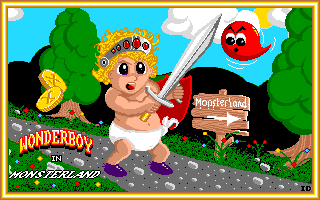 | 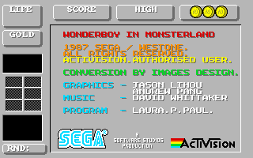 | 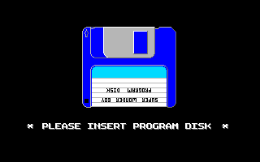 |

`boot_title_screen` ($e512..$e550) arms the protection, asks `load_resource_by_index` for
`TITLESCR.RAD` across the seam, inflates it with `rad_depack` straight onto the screen buffer and
hands its palette row to `set_palette`. `boot_credits_screen` does the same for `CREDITS.RAD`,
copies the result down onto the buffer the shifter is showing, and then runs `game_restart_reset`
over it — a new game, which is what draws the status panel's lives over the picture. The third is
`boot_prompt_screen` ($e494..$e4d4), the slice all three of the game's `jmp $e494.l`
endings land in: ESC, the game-over box expiring, and the message terminator the protection's own
failure path also reaches.

| Stage 1 begins | …and is played | The cast |
|:---:|:---:|:---:|
| 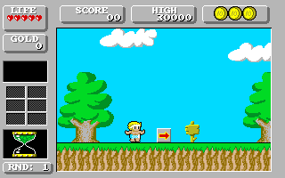 | 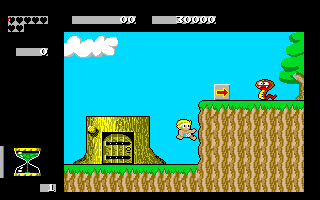 | 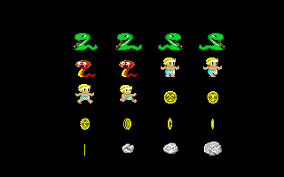 |

`boot_load_stage` ($e5ba..$f8b4) is the fourth slice and the longest: the level-sequence row, its
overlay, `TILEDATA.RAD` through `bg_tile_install`, `SPRITES.CRU` through `sprites_cru_install`,
the actor tables, and `stage_load_window`, which fills the scroll engine's **eight pre-shifted
copies** of the visible window. Everything after that is the frame loop's own fifteen calls, run
whole and in its order: the two keyboard ones, then the round bonus, then `panel_refresh_frame`
over `hud_draw_lives`, `hud_draw_meter` and the rest, the scene driver, and
`game_latch_input_and_step_actors` — which is where the joystick edge and every actor's behaviour
happen. Then the drawing: `project_followed_actor`, `bg_scroll_run_queue`, `project_actor_list`,
`bg_scroll_blit` — whose sixteen straight-line bodies, `bg_scroll_copy_x0` through `_x15`, differ
only in where each splits its thirty `move.l`s about the source row's 128-byte ring seam —
`game_snap_follow_cursor`, `sprite_draw_pass` and the twelve blitters it dispatches into
(`blit_sprite_w2`..`w5` and their left- and right-clipping siblings), `actor_spawn_pass`,
`text_run_message_box`, and `flip_screen` last. The middle frame is lap 157 of a fixed joystick
script — walk held, jump on a beat, fire on another — and it is **not a lap number chosen here**:
the run stops at the first frame that draws at least three sprites whole inside the play window,
and fails if none does, so a caption naming what is in a picture cannot go stale under a fix that
shifts the run. What that frame has is the hero in the air between a spinning gold coin and the
tree stump with the shop's door in it, with a red cobra on the ledge ahead beside the arrow sign.
The sheet beside it is the game's own bitmaps at their own addresses, drawn by `sprite_draw_pass`
onto the screen `clear_both_screens` left behind; only the destinations are ours. Which twenty are
shown is not a list chosen here either — it is every sprite that same run actually put into a
screen record, so the sheet is this stage's cast rather than a selection: four green snakes, two
red cobras, four frames of the hero's own walk, the seven-frame spin of a gold coin, and three
boulders.

| Round 4 — over the brick platforms | Round 5 — the wood | Round 5 — the vine shaft |
|:---:|:---:|:---:|
| 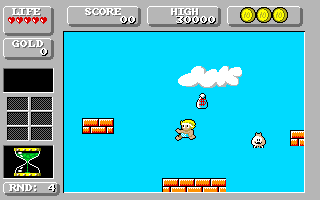 | 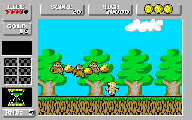 | 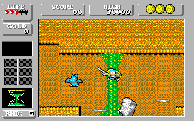 |

The later rounds are reached through **the game's own level-skip cheat**, typed rather than poked:
`game_key_actions`' walk at $5a8 steps a cursor along the four scancodes the binary carries at
$608 — `$61 $30 $13 $1e`, which are UNDO, B, R and A — and raises the cheat word when the cursor
meets its terminator. With that word up, N takes the arm at $556, which pops the frame loop's
return address and `jmp`s to $e5ba: `boot_load_stage` again, one sequence row further on. The
reconstruction cannot make that transfer, so it reports `WB_KEY_ACTIONS_LEVEL_SKIP` and the caller
runs the slice — which is exactly the wiring the on-target build uses for the same ending. One
thing here is this script's own and not the game's: the sequence cursor is put at the row before
the one being shown, because the honest route to round eight — playing there — is not something a
fixed joystick script can do. Everything either side of that is the boot's.

Two things about **which** rounds these are came out of getting the pictures wrong first, and both
are now checks rather than choices. The script takes the walk direction from the loaded row's own
start record: `boot_load_stage` drops the hero at `WB_START_FOLLOW_X`, and two of these rows start
him at 1928 and 1432 — the far end of a map he is meant to walk *back* along, with an arrow tile on
the ground saying so. Holding right there pinned him against a wall for 1400 frames with every
creature off the left edge, which is what the first published desert and castle pictures were. And
`sprites_cru_install` writes an UNMARKED sentinel into every descriptor the **round's** mask does
not mark, wholesale — rounds 2, 3, 10 and 11 do not mark the frames of a hero who has not picked up
the armour of the rounds before him, and arriving with a round-1 hero is exactly what the cheat
does, so in those rounds he was drawn as a band of scrambled bytes at his own position. The town of
round 2 and the golden keep of round 11 were in this gallery until that was found; the set is now
chosen among the rounds the skip can honestly show, and the script refuses a picture whose hero has
no cells.

| Round 6 — the spiked corridor | Round 8 — over the lava |
|:---:|:---:|
| 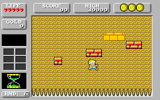 | 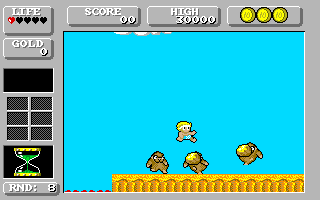 |

Each is a different overlay file, and each frame was chosen the same way stage 1's was — the first
frames 100…800 with at least a stated number of sprites whole inside the window, asserted before
the PNG is written. So the wood really does have three monkeys in its trees with gold hanging
between them — and a `GOLD` counter reading 16 beside a `SCORE` of 20, both earned by that run —
the vine shaft really has a blue flier, a falling boulder and thrown blades around a helmeted hero
with his sword out, and the lava has three creatures and two more pieces of gold. The message box
every stage entry posts — the frame loop's fourteenth call, `text_run_message_box`, composing the
first entry of the message table at `$a09c` — is long gone by then, so it is checked on the way
past at frame 30 instead of photographed, and checked in both directions: three of these five rows
hold it over frames 0…49 exactly, and two — the vine shaft and the lava — post no message at all.

The panel is the same one in all seven play pictures, and reading it is the quickest way to see
that the boot chain did its work: `LIFE`, `SCORE`, `HIGH`, `GOLD` and the slot frames are the
credits picture's own artwork, while the hearts, the digits and the `RND:` number are what
`game_restart_reset`, `panel_refresh_frame` and the `hud_draw_*` routines paint over it. `RND:` is
also the quickest check on a figure this README once had wrong: `WB_STAGE_NUMBER` is packed BCD, so
`$11` is round eleven and not seventeen, and the panel spells the digits out. Four of the data
disk's overlays are damaged on the pressed original — `OVALAY4B`, `OVALAY5B`, `OVALAY6A` and
`OVALAY9A`, the only files this project keeps two corpora of — and every picture here is rendered
from the **authentic** `bin/disk2/` dump, with the script refusing to load one of those four, so
no stage that needs them is shown.

---

## The fourth game — Zynaps

[`projects/zynaps/`](projects/zynaps/) is the same pipeline pointed at a horizontally-scrolling
shoot-em-up — Dominic Robinson's 1987 Spectrum and C64 game, converted to the ST by Microwish and
published by Hewson in 1988 — and it is the first one that begins at the **flux**. The disk is the
user's own floppy, read with a GreaseWeazle into a 39 MB five-revolution `.scp` that is never
written to, and the three images derived from it disagree in a way worth keeping: `zynaps.stx`
holds the protection and `zynaps.st` does not, because **cylinders 77, 78 and 79 were formatted
with the wrong track number in every sector's address field**, so a WD1772 seeking there gets
record-not-found and a sector copier gets a 30-sector hole. `ZYNAPS17.PRG` never asks. Its entire
OS-call census is four GEMDOS traps, one Line-A opcode and one XBIOS trap inside dead code — there
is no `Floprd`, no `Rwabs`, not one reference to `$ff86xx` in the whole 40,774-byte text — the game
plays identically from the patched image and from a plain GEMDOS folder, and the last cluster any
file uses lands on cylinder 73, four short of the first protected one. Whether the format is
deliberate anti-copy or a duplicator's artifact is left open — `projects/zynaps/README.md` records
that both readings stay consistent with every measurement — but either way it costs a whole-disk
copier and nothing else: the three cylinders turn out to be byte-exact clones of the tracks their
address fields name, so the `.st`'s hole loses nothing. Getting *at* the files needed one more
fact: the boot sector's BPB says the volume has **one** FAT and it carries **two**, which no ST
notices — the Atari BPB has no FAT-count field at all — and which sends a host-side tool to read the
second FAT as the root directory and report an empty disk. Both traps are written up as general
procedure in [`docs/binary-formats.md`](docs/binary-formats.md).

**Status: 217 verified ranges · 4751 tests, green under `make test`** (plus 464 in the shared kit).
Both numbers are shapes rather than totals and
[`recreate/STATUS.md`](projects/zynaps/recreate/STATUS.md) is careful about which: 189 of those
ranges are whole functions, and 28 are named **slices** — address ranges rather than routines,
verified from a named entry PC to a named checkpoint PC, each row stating the `[start, end)` it ran.
They live inside five `fn` lines, and the two reasons are different: `_start` and the frame loop
have no `rts` between their ends, while `title_attract_loop` does and still cannot be run whole,
because it programs an MFP register and then spins reading it back — a read the kit's seeded model
refuses as a stale seed. That file counts the program at 195 functions, records that six of them
are not ported whole, and lists the ranges rather than rounding them away.

**On target, the reconstruction is the game.**
[`recreate/atari/`](projects/zynaps/recreate/atari/README.md) cross-compiles those verified cores to
m68k and composes every slice of `_start`, of `title_attract_loop` and of the section chain in the
original's own order, then calls `frame_loop_once` until it leaves — so `ZYNAPS.PRG` boots, shows
its attract screen, starts a game, plays a section, dies and restarts, **and nothing on the path
runs a body `STATUS.md` does not carry a verified row for**. `smoke.py game` judges it against the
shipped 1988 binary with a **frame differential**: both are booted, given the same input, parked on
the same seed, and sampled at the same numbered frames of the same section by the loop head's own
pass count. At frames 1, 30, 60, 120 and 240 the **32000-byte framebuffer is byte-identical, the
twenty entity records are byte-identical, and the sixteen colour registers agree**. Every one of
those samples is inside the FIRST LIFE, and deliberately: past a death the two sides' random streams
diverge on how long the fire wait took, so the build reports the frame the first life ended on and
the smoke refuses a sample at or past it. The death and the restart are things the program does, not
things this differential compares. `gamefault` is
the negative control — one step of the section chain dropped — and reddens the drawing at every
frame while the pens and the exit path stay green. `build.sh play floppy` writes a bootable 720 KB
`ZYNAPS.ST` that TOS 1.04's own `AUTO` scan starts from drive A, and the whole build lives inside a
**1 MB machine: 597,470 bytes, 310,668 to spare**. And Zynaps has now climbed the rung Wonder Boy
did — **the user booted the reconstruction's own `ZYNAPS.ST` on their 4 MB STE and it plays well**.
What has NOT crossed with it is the MEASUREMENTS: Hatari refuses `--machine ste` on a ROM at or
below TOS 1.4 and this workspace has no later one, so every cycle and vblank figure stays emulated;
`atari/README.md` says so in its own list of what is unpinned rather than leaving it to be assumed.

**Zynaps is also the project where speed became a correctness problem.** A faithful C
reconstruction of a 1988 shoot-em-up is not automatically playable: the first working build ran at
**5.73 vertical blanks a frame — 8.7 fps against the original's 25** — and no amount of byte-exact
output makes that the game. Five waves of hand-written 68000 **twins** for the hot paths took it to
**2.51, 19.8 fps**, and every twin is a substitution rather than a rewrite: each carries the C
signature of the routine it replaces, is linked instead of that C on the target build, and is pinned
against the C by the same differential over the same staged worlds — 33 of them, in
[`src/asm/`](projects/zynaps/recreate/src/asm/). The lesson the campaign wrote down is in its last
two waves: wave D twinned what an inclusive profiler row pointed at and bought **13 cycles a frame**
across 699 instructions — so its three twins are built and verified and **not shipped at all**, and
the game keeps the C; wave E measured what a *busy* frame costs and bought ~36,000 with 86. An
inclusive row is not a prize, and a mean is not a distribution.

**A few things in the build are deliberately not the 1988 program, and all of them live in the shim.**
Typing `Z`, `Y`, `N` in order at the title arms a trainer — `F1` invulnerability, `F2` lives, `F3`
maxed power-ups (`atari/zynaps_cheats.c`). And two control keys the original reads nowhere give a
player what a program that never returns from supervisor cannot: **ESC** sends a game back to the
attract screen (re-using the game's own all-lives-lost path) and **F10** hands the machine back to
TOS (re-using the shim's teardown) — `atari/zynaps_main.c`, plus one more tap in the shim's
`hw_read8` beside the trainer's. No core moved, `make test` is unchanged, and the frame differential
is still byte-identical, because every one is inert in the judged runs: each mode asserts the trainer
AND the two control keys stayed dormant, and `smoke.py cheats` / `smoke.py controls` are the positive
controls that drive them through Hatari's own keyboard.

**And a finished reconstruction is a good instrument for asking what a game hides.**
[`projects/zynaps/README.md`](projects/zynaps/README.md)'s *Secrets and dead code* is a hunt for
what the binary *has* and does not use, with every positive claim demonstrated **on the original
binary in Hatari** — never on the recreate — and every negative result reported as plainly:

- **no hidden key beyond the manual's own pause.** The census of every reader of the key byte is
  exhaustive: the only in-game key is `SPACE` at `$10fda` — the pause **the manual documents**, no
  secret at all. It was still worth the run: this workspace had never exercised it, three of its own
  prose surfaces claimed `SPACE` turned the front-end pages instead (all corrected), and the
  demonstration — five boots, two press-pause-press cycles each, the paused captures byte-identical
  — is what proved the key-reader census closed with nothing undocumented behind it.
- **a dormant invulnerability flag.** `ship_invulnerable` at `$19912` is read by three instructions
  — the ship's record and its shadow flying into the landscape, and the ship touching anything
  lethal — and **written by none**.
- **a cut enemy the game still makes room for.** `$148ca` is an actor move handler of the ordinary
  shape that nothing references: sweep in from the right, turn at x = 200 on a sine, fly back out.
  What makes it more than a leftover is the 13-byte array at `$19673` it is the only reader of —
  which `section_start_tail` still clears on every section start. The shipped game resets state for
  an enemy that was cut.
- **art and audio with no caller.** The binary's 31 filename strings become 60 names through six
  patch sites, and four of the disk's 62 files are named by none of them — one being TOS's own
  `DESKTOP.INF`, which leaves three of the game's. `ROTBALLS.DAT` is 360 bytes of finished art in
  exactly the geometry and byte count of the missile sprites the game does load. Nine of the 45
  sound streams can be started by nothing in the image.

All 45 of those streams are dumped by [`tools/extract_audio.py`](projects/zynaps/tools/extract_audio.py),
which does not re-implement the driver — it runs the game's **own** 68000 replayer under the
Musashi oracle and taps the chip writes — and the dump is judged against a Hatari recording of the
real game: 1,000 compared frames of the title tune replay register for register.

### Gallery — Zynaps

Rendered **host-side by the reconstruction**, with no emulator and no TOS ROM in the loop:
`projects/zynaps/gen_readme_assets.py` loads your own `ZYNAPS17.PRG` through the kit, serves the
twenty-two files `_start` opens and each section's own five to seven across the kit's staged-file
model, and drives the same entry points the tests drive — every slice of `_start`, of the attract
loop and of the section chain, then `frame_loop_once` itself — before de-interleaving what they
paint. No oracle runs: `test_frame.py` stages its worlds by stepping the *original's* machine code
through Musashi, and this script deliberately does not, because a picture drawn by the oracle would
be a picture of the 1988 binary.

**Neither the palette nor the buffer is chosen by the script**, and for the same reason: the two
registers that decide them — the sixteen colour words at `$ff8240` and the screen base at
`$ff8203`/`$ff8201` — are far above the 1 MiB image, so memory holds the candidates and not which
one is in force. Zynaps carries **four** sixteen-pen rows any of which could be a picture's palette,
and two framebuffers one of which is a frame behind; picking wrong in either gives a plausible
picture of the wrong thing, which is measured rather than hypothetical — the first draft of this set
rendered a level in the title screen's colours. So both come out of the kit's **hardware-write
ledger**, the one both sides of the differential already keep. The pens are the upload
`attract_build_colour_bars` makes for the two front-end pages, and for the rest the one the
reconstruction's own `vbl_menu` makes when the script runs it — the handler the `$70` vector holds
from `boot_program_raster_timer` onward — on a *copy* of the pictured state. The buffer is whichever
base the run last published, and the script refuses a picture whose `screen_front` pointer disagrees
with it.

Every picture of a section runs the **whole boot and section chain**, in the order
`recreate/atari/zynaps_main.c` composes it on the machine — the two front-end pages stop where the
game does, at the attract loop. That is not thoroughness for its own sake: the status panel along the
bottom of every play frame is drawn by no part of the frame loop. `boot_load_title_assets` reads
`STATUS.PI1` and carves three strips out of it, `status_panel_build_master` composes the panel, and
`section_restart_prologue` stamps it into both framebuffers and flips, which is also what sets the
buffer parity every later picture is taken at. The set was rebuilt once already after a review found
three of those steps missing, and nine of the eleven pictures moved.

Which frame each play picture is, is **searched for rather than typed**, with one stated exception: a
section is played with one fixed joystick script — `test_frame.world_rng`'s own stream, so the worlds
here are the worlds under `make test` — and the frame kept is the first that meets a stated census,
so a caption about the *shape* of a frame cannot outlive a change that shifts the run; the run
refuses instead. The exception is the opening frame, which is a picture of a moment and takes a
stated number. The censuses are floors, so the exact counts quoted below are what today's run
printed rather than guarantees. The whole set is rendered twice per invocation and a differing pair
is refused.

| Title | Role of honour | Prepare for combat |
|:---:|:---:|:---:|
| 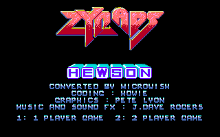 | 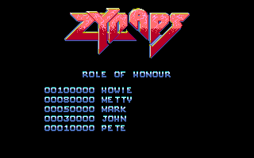 | 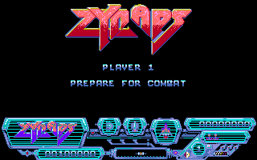 |

`attract_build_colour_bars` builds the raster list, uploads the front-end palette — the upload those
first two pens come from — and calls `title_screen_draw`, which lays three 64-row strips of
`ZYNLOGO.DAT` and then runs straight on into `HEWLOGO.DAT`, whose bytes `_start` loaded at the very
next address and which the routine reaches without reloading its source pointer. `attract_next_page`
swaps to `role_of_honour_screen` on its own 750-frame timer: the same three strips, the heading, and
five rows of the table the shipped `.PRG` itself carries. Each **name** in them is drawn at the row
byte inside its own record while each **score** is drawn at a `lea` displacement of the routine's
own — two spellings that agree only because the shipped table happens to make them, and a table
whose rows had been edited would put the names and the scores on different lines. One thing is
missing from the title page and cannot be there: the colour bars behind the logo are painted by
`attract_rasterbar_isr` one scanline at a time straight into pen 0, so they exist on a raster and in
no buffer at all. The third picture is the screen the
section start holds at until the player presses fire, drawn by `player_intro_screen` over the panel
`section_reload_intro_screens` and `section_restart_prologue` have just stamped into both buffers.
It is photographed at that instant — before the fire poll the next slice spins in, which is a wait
only the kit's scheduled-write model can end because the byte it reads is one only the IKBD
interrupt writes, and which every play picture below crosses.

| Section 1 begins | …and is played | Section 2 — the asteroid field |
|:---:|:---:|:---:|
| 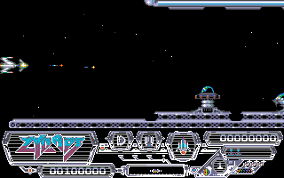 | 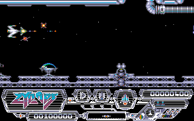 | 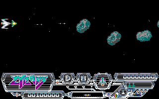 |

Sections are numbered here as the player meets them, 1 to 16, which is the binary's own
`level_section` plus one. Eight frames into the first — a stated number, because "the start" is what
that picture is of — the scroller has moved and the first ground base has come over the horizon. The
second stops at frame 129, the first with ten live entity records, and the wave script is spawning
into a landscape the tile emitter has been feeding a column at a time. The third is one of the four
sections whose type byte is `'q'`: an **asteroid field with no map at all**, where
`section_load_assets` takes its
other arm entirely — one `BIGAST.DAT` load, six sprite banks built and preshifted over 46 KB of
compose buffer, and a fixed palette row where a map section takes a per-section one. The run stops
there at the first frame with twelve of the eighteen asteroid records in flight, and those are not
entity-table records: the field has its own array, which is why the picture's census counts a
different thing. That the arm the picture is captioned for is the arm the section actually took is
the script's own assertion, taken from the answer `section_load_assets` returns.

| Section 9 | Section 12 | Game over |
|:---:|:---:|:---:|
| 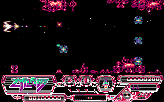 | 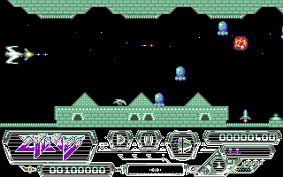 | 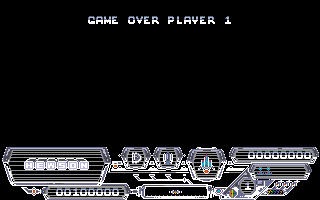 |

The two later sections were picked by rendering **all sixteen** through this same script and keeping
the two that look least like section 1's blue-grey lattice — section 9 is a magenta cloud bank over
open space, and section 12 a jade cavern with a tiled ceiling as well as a floor, which is a
different *tile set* and not only a different palette. Six of the sixteen cannot be shown at all
under this joystick script, for an honest reason: a fixed stream of stick bytes flies a ship that
dies, and the run refuses to publish a frame from a section whose census it never met. The last is
`game_over_screen_prologue` — the back buffer cleared and `GAME OVER PLAYER 1` drawn over the panel,
in the section's own colours because the fire gate has been crossed and that is what commits the
palette the vertical blank uploads. The prologue and not the whole screen: `game_over_screen` runs
straight on into a high-score arm that types a name one console key per call, and this set has no
keyboard in it.

| The missile frames the game loads | …and a file no load site opens |
|:---:|:---:|
| 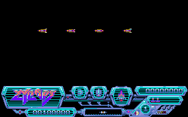 | 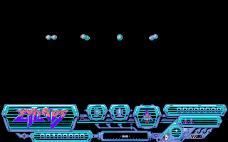 |

The two sheets are the **same run with one thing different**: which bytes the staged-file model
hands back when `section_load_assets` asks for the section's missile file. On the right it is
`ROTBALLS.DAT`, the cut file, and the section flow loads it, splits it into four frames and
preshifts it without noticing — because at 360 bytes of masked 16×9 art it is a drop-in fourth
sprite set. What the sheet chooses is what a sheet must, and no more: where the frames are put. The
bytes are the file's, each of the four banks is checked against the file's own frames before
anything is drawn, the row count is derived from the file's length rather than typed, and the blit
is the game's own `draw_sprite_masked` at an x on a cell boundary — the arm that reads a bank slot
unshifted. The script fails if the two pictures come out the same.

---

## Quick start

**Prerequisites:** Ghidra 12 (scripts are Java — Ghidra 12 dropped Jython), JDK 21, Python 3.10+,
a C compiler, and the Hatari emulator plus your own TOS ROM for on-target runs.

```bash
# 1. reverse a binary of your own
bash tools/new_project.sh mygame path/to/GAME.PRG
bash projects/mygame/run.sh

# 2. reproduce the Buggy Boy reconstruction (needs your own game files in projects/buggyboy/bin/)
cd projects/buggyboy/recreate
make venv && make test          # builds the Musashi oracle + the C cores, runs the differential suite
make bench                      # per-frame cost: original 68000 vs the reconstruction

cd ../remaster
make test                       # pixel-equivalence against the verified cores

# 3. ...or the Joust one (needs your own bin/JOUST.PRG under projects/joust/)
cd ../../joust/recreate
make venv && make test          # the shared kit's oracle + the C cores, the differential suite
./.venv/bin/python ../gen_readme_assets.py   # re-render this README's Joust images, host-side
bash atari/build.sh && bash atari/run.sh     # ...or play it on a 68000, under Hatari

# 4. ...or the Wonder Boy one (needs your own bin/disk1/ and bin/disk2/ under projects/wonderboy/)
cd ../../wonderboy/recreate
make venv && make test                       # the shared kit + the C cores, the differential suite
./.venv/bin/python ../gen_readme_assets.py   # re-render this README's Wonder Boy images, host-side
bash atari/build.sh ownrun && bash atari/run.sh   # ...or play it on a 68000, under Hatari
python3 atari/smoke.py floppy                # ...or build atari/out/WBOOT.ST — a bootable 720 KB
                                             # FAT12 floppy carrying the build and all 40 resources.
                                             # gw/write_disk.sh puts it on real media; see
                                             # atari/HARDWARE.md for the STE runbook.

# 5. ...or the Zynaps one (needs your own bin/ZYNAPS17.PRG and bin/disk/ under projects/zynaps/)
cd ../../zynaps/recreate
make venv && make test                       # the shared kit + the C cores, the differential suite
                                             # (also needs m68k-elf-gcc: the asm twins are assembled
                                             #  before the suite runs)
./.venv/bin/python ../gen_readme_assets.py   # re-render this README's Zynaps images, host-side
bash atari/build.sh play && bash atari/run.sh     # ...or play it on a 68000, under Hatari
bash atari/build.sh game && python3 atari/smoke.py game   # ...or judge it against the 1988 binary,
                                             # frame by frame
```

## Repo layout

```
reverse/
├── docs/                     transferable knowledge, one file per expertise domain
├── tools/                    game-agnostic tooling
│   ├── prg_dis.py            GEMDOS .PRG analyzer + 68000 first-pass disassembler
│   ├── extract_graphics.py   ST 4-plane / RLE graphics → PNG
│   ├── depack_gamex.py       static depacker for the Gamex/"PP" LZSS cruncher
│   ├── depack_lsd.py         static depacker for the "LSD!" backwards-LZ cruncher
│   ├── ghidra_scripts/       PrgLoader · LineAResolve · SeedFunctions · AtariOsTrapAnnotate ·
│                             ExportDecompC · ApplyNames · …
│   ├── hw_portability.py     how much of a game a memory-only differential can verify
│   ├── headless.sh           bootstrap: import → load → resolve Line-A → analyze →
│                             seed orphan code → annotate → export
│   ├── reapply.sh            fast naming loop: apply names.txt → re-export
│   ├── hw_scan.sh            dump bodies + call graph + hardware accesses → TSV
│   ├── hatari_run.sh         run a game in Hatari (unpack in-place, then dump memory)
│   ├── new_project.sh        scaffold projects/<name>/
│   └── recreate_kit/         shared differential harness: PRG loader, Musashi oracle,
│                             TOS traps — bound to a game by its recreate/project.toml
└── projects/                 one directory per reversed game, scaffolded by new_project.sh
    ├── buggyboy/             names.txt · decomp.c · recreate/ · remaster/ · docs/
    ├── joust/                names.txt · decomp.c · recreate/ (+ atari/ — the playable PRG)
    ├── wonderboy/            names.txt · decomp.c · recreate/ (+ atari/ — the PRG, and the
    │                         720 KB floppy it boots a real STE from) · notes/ · tools/
    └── zynaps/               names.txt · decomp.c · recreate/ (+ atari/ — the playable PRG, its
                              frame differential against the 1988 binary, and src/asm/'s 68000
                              twins) · tools/ (the disk, audio and secrets instruments)
```

## Documentation

Thirteen domain guides, each grounded in real evidence from the four solved games but written as
general procedure.
Start with [`docs/00-overview.md`](docs/00-overview.md) for the end-to-end workflow and a "what kind
of file is this?" decision tree, then [`docs/agent-playbook.md`](docs/agent-playbook.md) for the
verification loop that ties the rest together. Full index: [`docs/README.md`](docs/README.md).

| | |
|---|---|
| [binary-formats](docs/binary-formats.md) | parse a `.PRG`/`.TOS`/`.TTP`, its header, symbols, relocations |
| [packed-executables](docs/packed-executables.md) | the entry is garbage — depack via Hatari before analyzing |
| [m68k-disassembly](docs/m68k-disassembly.md) | read 68000 asm, avoid sweep desync, spot jump tables |
| [ghidra-pipeline](docs/ghidra-pipeline.md) · [ghidra-gui](docs/ghidra-gui.md) | drive Ghidra headless, then explore interactively |
| [tos-os-calls](docs/tos-os-calls.md) | GEMDOS/BIOS/XBIOS/GEM calls and Line-A `$aXXX`, basepage, loaders |
| [hardware-map](docs/hardware-map.md) | video/sound/MFP/IKBD registers, interrupts |
| [graphics](docs/graphics.md) · [sound](docs/sound.md) | planar bitmaps, palettes, RLE; the YM2149 driver |
| [on-target-execution](docs/on-target-execution.md) | run the verified reconstruction on real hardware |
| [methodology](docs/methodology.md) | actually name things: anchors → outward, verify, iterate |

## Use it on another binary

Nothing above is game specific except the per-game directories under `projects/`. `new_project.sh`
scaffolds a new target, the Ghidra scripts and the naming loop work on any GEMDOS executable, and
the differential harness is now a shared component rather than a pattern to copy — `recreate_kit`
takes the entry addresses and the memory image from a `project.toml`, as Joust's second use of it
showed. A game binds the kit's optional capabilities the same way: Joust needed none of them,
Wonder Boy needed two — the **file-load seam** (`disk_read_file`, for a boot chain that ends in a
raw sector driver) and the **scheduled-write model** (for a routine that busy-waits on a byte only
an interrupt ever stores) — and Zynaps needed that same scheduled-write model plus two more, the
**seeded-hardware read model** and the **hardware-write ledger** (an ordered address/width/value
stream both sides keep), because a game whose palette and screen base live above the 24-bit bus
makes stores no byte diff can see. If the entry point disassembles to garbage the binary is packed;
`prg_dis.py` prints entropy, and [`docs/packed-executables.md`](docs/packed-executables.md) covers
unpacking it — live in Hatari and analyzing the memory dump, or statically once the packer is
understood. And if it barely uses the OS at all, check where it really runs: a `.PRG` with almost no
relocations is position-dependent, and Wonder Boy's own README has how that was found.

## Credits & legal

**Buggy Boy** for the Atari ST — *program and graphics by Martin W. Ward, sonics by Jas. C. Brooke*
(both credited on the game's own intermission screen, reproduced above), published by Elite Systems
International, 1988 (per the copyright string in the binary itself). All rights in the game belong
to their respective owners.

**Joust** for the Atari ST — the title screen the reconstruction draws above is the binary's own
credit, verbatim: *"PRESENTED BY ATARI CORPORATION"* and *"COPYRIGHT 1985 BY THE RUGBY CIRCLE,
INC."*, the two strings `title_screen` reads out of the program image at `0x183d5`. Joust itself is
Williams Electronics' 1982 coin-op, of which this is a licensed home conversion; the copy analysed
here is the later Gamex release, whose own `README.TXT` is signed "PP". All rights in the game and
in the arcade original belong to their respective owners.

**Wonder Boy in Monsterland** for the Atari ST — the binary carries no copyright string at all, so
the credit reproduced here is the game's own credits screen, drawn by the reconstruction above and
transcribed verbatim: *"WONDERBOY IN MONSTERLAND / 1987 SEGA / WESTONE. / ALL RIGHTS RESERVED. /
ACTIVISION.AUTHORISED USER. / CONVERSION BY IMAGES DESIGN. / GRAPHICS - JASON LIHOU, ANDREW PANG /
MUSIC - DAVID WHITTAKER / PROGRAM - LAURA.P.PAUL."*, over the SEGA and ActiVision logos and the line
*"A SOFTWARE STUDIOS PRODUCTION"*. `names.txt`'s own header dates the release to Activision/Sega,
1989. The arcade original is Westone and Sega's 1987 *Wonder Boy in Monster Land*, of which this is
a licensed home conversion. All rights in the game and in the arcade original belong to their
respective owners.

**Zynaps** for the Atari ST — the credits reproduced here are the game's own title page, drawn by
the reconstruction above and transcribed verbatim: *"CONVERTED BY MICROWISH / CODING : HOWIE /
GRAPHICS : PETE LYON / MUSIC AND SOUND FX : J.DAVE ROGERS"*, under the ZYNAPS and HEWSON logos. The
game was written by Dominic Robinson and published by Hewson Consultants for the Spectrum and C64 in
1987; this is the 1988 ST conversion. All rights in the game belong to their respective owners.

This repository contains **no game code or data** — no executable, no `COURSES.DAT`, no
`GRAPHICS.GRA`, no `JOUST.PRG`, no `JOUSTS.CTE`, no `HIGH.SCO`, no `SWB.PRG`, none of the `.RAD`
resources (`TITLESCR`, `CREDITS`, `DATADISK`, `TILEDATA` and the thirty-seven `OVALAY*` overlays),
no `SPRITES.CRU`, no `ZYNAPS17.PRG`, none of Zynaps' sixty-two data files, no flux or sector dump of
any of these four games' floppies, no disk image of any of them, and no TOS ROM image. It holds
analysis,
documentation, tooling, and independently written C. The images in this README are output of that
reconstruction, included to document what it produces; reproducing them at all requires the game
files this repository does not ship. Running any of it requires a copy of the game you already own.

Reverse engineering here is for interoperability, preservation and study.

**License.** The work in this repository — the tooling, the documentation and the reconstructed C —
is Copyright © 2026 Geoffrey Anneheim and released under the **GNU General Public License, version
2** ([`LICENSE`](LICENSE)). That covers this repository's own contents only; it grants no rights in
Buggy Boy, Joust, Wonder Boy in Monsterland or Zynaps, all of which remain the property of their
owners.
