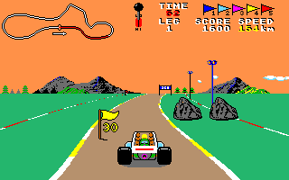
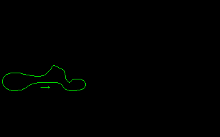
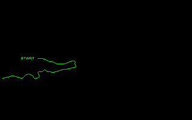
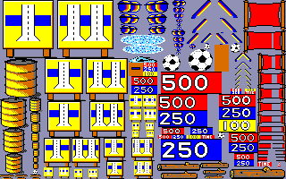

# Atari ST — from binary to remaster

Recovering a lost 1988 Atari ST game from its shipped executable: disassemble it, name every
function, rewrite it as readable C **proven byte-for-byte against the original machine code**, then
build a free, optimized remaster that is **pixel-identical** to what the original drew — and run it
back on the 68000.

<p align="center">
  
</p>

<p align="center"><em>Not a screenshot of the original program — this frame was drawn by the
reconstruction: its road rasterizer, scroll blitter, object dispatcher and HUD, over the game's own
<code>COURSES.DAT</code>.</em></p>

**Buggy Boy** (Elite Systems, 1988) is the worked example, solved end to end:
**91/91 functions verified** · **~20 000 lines of reconstructed C** · **69 test modules** ·
**driveable on a 68000**. The tooling and the
[documentation](docs/README.md) are game-agnostic — point them at any GEMDOS `.PRG`.

> **No game data is distributed here.** No `.PRG`, no `COURSES.DAT`, no `GRAPHICS.GRA`, no TOS ROM.
> Bring your own copy; see [Credits & legal](#credits--legal).

---

## The three stages

```
   BUGGYBOY.PRG                              ── the shipped 1988 binary (you supply it)
        │
        │  tools/prg_dis.py · Ghidra headless · names.txt naming loop
        ▼
1. DISASSEMBLE & NAME     decomp.c — 91 named functions, anchored on OS traps + hardware regs
        │
        │  rewrite as idiomatic C, then diff every function against a cycle-accurate 68000
        ▼
2. RECREATE               recreate/ — readable C, each function byte-for-byte == the original
        │                            (oracle: Musashi running the real machine code)
        │  rewrite freely for speed and clarity; the only rule is the frame must not change
        ▼
3. REMASTER               remaster/ — native structs, faster algorithms, pixel-identical output
        │
        ▼
   BUGGYBOY.PRG on a 68000                    ── cross-compiled back to m68k, runs under Hatari
```

Each stage is refereed by the one above it, so nothing can go wrong quietly. Stage 2 is judged by a
cycle-accurate emulator running the original machine code; stage 3 is judged, frame by frame,
against stage 2's verified cores.

---

## Gallery

Everything below was **rendered by the reconstruction**, then decoded from the Atari's 4-plane
framebuffer with the game's own palettes. Regenerate the whole set — byte-identical every run — with
`projects/buggyboy/gen_readme_assets.py`, run under `recreate/`'s venv.

### In-race frames — three courses, driven for real

Staged from the real course data, driven with the throttle held through the verified `game_update`,
then drawn by the verified render pipeline (road → scroll → objects → HUD).

| `OFFROAD` | `NORTH` | `SOUTH` |
|:---:|:---:|:---:|
|  |  |  |

The course map in the top-left corner is built per leg by `init_leg_dash` out of `COURSES.DAT` and
blitted every frame by `draw_dashboard`; the trace along it is the player's live progress.

### Screens

| Credits | Leg board | High scores |
|:---:|:---:|:---:|
|  |  |  |

### Course data and sprites

`COURSES.DAT` turned out not to be a script but road-slice **bitmap** data, streamed eight bytes at a
time through a circular buffer. Walking it recovers each leg's shape:

| `OFFROAD` | `WEST` |
|:---:|:---:|
|  |  |

`GRAPHICS.GRA` is a sprite table plus an RLE stream that unpacks to eight 320×200 four-plane atlases:

| Gates & score markers | Roadside scenery |
|:---:|:---:|
|  |  |

[`projects/buggyboy/docs/function_graph.html`](projects/buggyboy/docs/function_graph.html) is a
standalone call-graph explorer covering all 117 functions — open it in a browser, no server needed.
With your own copy of the game you can go further: `gen_assets.py` regenerates the full media set
(every sprite page, per-object crops sliced by driving the real blitter, buggy animations as GIFs,
and the soundtrack re-rendered through the reconstructed YM2149 driver), and re-running
`gen_graph.py` attaches all of it to the functions that produce it. Generated media is not stored
in this repository.

---

## Stage 1 — Disassemble & name

Load the `.PRG` at a known base, let Ghidra analyze, then iterate a plain-text name map until the
decompilation reads like source.

```bash
bash tools/new_project.sh mygame path/to/GAME.PRG   # scaffold projects/mygame/
bash projects/mygame/run.sh                         # import → analyze → annotate → decomp.c
#  read decomp.c → append to names.txt → reapply → re-read
bash projects/mygame/reapply.sh
```

`names.txt` is the source of truth — one directive per line, addressed as Ghidra sees them
(image offset + load base):

```
fn   0x1555e draw_hud
var  0x18c38 leg_index
cmt  0x1110e game_update: input, integrate throttle->speed, steering->road_curve, stream course…
```

The method is **anchors outward**: start from ground truth an emulator cannot dispute — GEMDOS/BIOS
trap numbers, DRI symbols, hardware register addresses, string literals — and propagate along the
call graph. Then *verify by reading the body*; several confident first guesses in this project were
wrong until someone actually read the code ([`docs/methodology.md`](docs/methodology.md)).

**Result for Buggy Boy:** 335 name directives, all 91 functions named, plus a decoded loader,
course format, sprite format, event jump table and sound driver.

## Stage 2 — Recreate: prove it

Buggy Boy was hand-written assembly, so there is no original source to recompile and byte-match
against. Instead we prove **behavioural equivalence**: run the real machine code and the
reconstruction on identical memory, then diff.

```
          initial memory image + registers
                     │
        ┌────────────┴─────────────┐
        ▼                          ▼
  ORACLE (real 68k)          CANDIDATE (our C)
  Musashi via liboracle.so   libbuggyboy.so via ctypes
        │                          │
        ▼                          ▼
  final memory + write-set   final memory
        └──────────► diff ◄────────┘   green = byte-for-byte identical
```

Both sides share one flat big-endian image whose indices are the game's real addresses. The harness
diffs the *whole* image, so a byte the original writes that the reconstruction misses fails the test.
Leaf functions can additionally opt into an attribution pass that poisons oracle-written bytes first,
so a candidate that matches *coincidentally* is caught rather than passing.

Functions that never return (`_start`, the interactive loops) are verified at a checkpoint PC, with
any excluded stack band vetted against the oracle's deepest stack pointer so an exclusion cannot hide
a divergence.

**Status: 91/91 verified.** See [`recreate/STATUS.md`](projects/buggyboy/recreate/STATUS.md) for the
per-function table and how each one was pinned.

## Stage 3 — Remaster: free it

`recreate/` proves what the original does. `remaster/` is free to look nothing like 68000 assembly —
native structs instead of a flat image, real types, precomputed tables, better algorithms — subject
to exactly one rule:

> For any given input, the remaster must produce a **pixel-identical framebuffer** to the verified
> `recreate/` cores, every frame.

The two use deliberately different memory layouts, so their internal state cannot be diffed. The one
surface they share is the thing the player sees, and that is the comparison surface. An optimization
that moves a single pixel fails.

- **Phase A — render pipeline: green.** Road geometry, rasterizer, scroll blitter, ground/horizon,
  sprites, scaled objects, the fine-x blit engines, the object-list dispatcher and all eight HUD
  phases are ported and byte-exact over the whole framebuffer.
- **Phase B — gameplay: in progress.** Course streaming, the object ring, player physics and the
  crash/auto-steer script are ported and frame-exact; sound, collision probing and event dispatch
  are not started.
- **On target:** `BUGGYBOY.PRG` — the playable game (no sound) — cross-compiles back to m68k and runs
  under Hatari, loading the unmodified `COURSES.DAT` and `GRAPHICS.GRA` at boot. It boots into the leg
  select; its leg-0 start frame is byte-identical to the reconstruction's, and it is driveable.

See [`remaster/STATUS.md`](projects/buggyboy/remaster/STATUS.md) for the per-subsystem table.

---

## Quick start

**Prerequisites:** Ghidra 12 (scripts are Java — Ghidra 12 dropped Jython), JDK 21, Python 3.10+,
a C compiler, and the Hatari emulator plus your own TOS ROM for on-target runs.

```bash
# 1. reverse a binary of your own
bash tools/new_project.sh mygame path/to/GAME.PRG
bash projects/mygame/run.sh

# 2. reproduce the Buggy Boy reconstruction (needs your own game files in projects/buggyboy/bin/)
cd projects/buggyboy/recreate
make venv && make test          # builds the Musashi oracle + the C cores, runs the differential suite
make bench                      # per-frame cost: original 68000 vs the reconstruction

cd ../remaster
make test                       # pixel-equivalence against the verified cores
```

## Repo layout

```
reverse/
├── docs/                     transferable knowledge, one file per expertise domain
├── tools/                    game-agnostic tooling
│   ├── prg_dis.py            GEMDOS .PRG analyzer + 68000 first-pass disassembler
│   ├── extract_graphics.py   ST 4-plane / RLE graphics → PNG
│   ├── depack_gamex.py       static depacker for the Gamex/"PP" LZSS cruncher
│   ├── ghidra_scripts/       PrgLoader · AtariOsTrapAnnotate · ExportDecompC · ApplyNames · …
│   ├── headless.sh           bootstrap: import → load → analyze → annotate → export
│   ├── reapply.sh            fast naming loop: apply names.txt → re-export
│   ├── hatari_run.sh         run a game in Hatari (unpack in-place, then dump memory)
│   └── new_project.sh        scaffold projects/<name>/
└── projects/<name>/          per-game: names.txt · decomp.c · recreate/ · remaster/ · docs/
```

## Documentation

Thirteen domain guides, each grounded in real Buggy Boy evidence but written as general procedure.
Start with [`docs/00-overview.md`](docs/00-overview.md) for the end-to-end workflow and a "what kind
of file is this?" decision tree, then [`docs/agent-playbook.md`](docs/agent-playbook.md) for the
verification loop that ties the rest together. Full index: [`docs/README.md`](docs/README.md).

| | |
|---|---|
| [binary-formats](docs/binary-formats.md) | parse a `.PRG`/`.TOS`/`.TTP`, its header, symbols, relocations |
| [packed-executables](docs/packed-executables.md) | the entry is garbage — depack via Hatari before analyzing |
| [m68k-disassembly](docs/m68k-disassembly.md) | read 68000 asm, avoid sweep desync, spot jump tables |
| [ghidra-pipeline](docs/ghidra-pipeline.md) · [ghidra-gui](docs/ghidra-gui.md) | drive Ghidra headless, then explore interactively |
| [tos-os-calls](docs/tos-os-calls.md) | GEMDOS/BIOS/XBIOS/GEM calls, basepage, loaders |
| [hardware-map](docs/hardware-map.md) | video/sound/MFP/IKBD registers, interrupts, Line-A |
| [graphics](docs/graphics.md) · [sound](docs/sound.md) | planar bitmaps, palettes, RLE; the YM2149 driver |
| [on-target-execution](docs/on-target-execution.md) | run the verified reconstruction on real hardware |
| [methodology](docs/methodology.md) | actually name things: anchors → outward, verify, iterate |

## Use it on another binary

Nothing above is Buggy Boy specific except `projects/buggyboy/`. `new_project.sh` scaffolds a new
target, the Ghidra scripts and the naming loop work on any GEMDOS executable, and the differential
harness pattern transfers whole — swap the entry addresses and the memory image. If the entry point
disassembles to garbage the binary is packed; `prg_dis.py` prints entropy and
[`docs/packed-executables.md`](docs/packed-executables.md) covers unpacking it live in Hatari and
analyzing the memory dump.

## Credits & legal

**Buggy Boy** for the Atari ST — *program and graphics by Martin W. Ward, sonics by Jas. C. Brooke*
(both credited on the game's own intermission screen, reproduced above), published by Elite Systems
International, 1988 (per the copyright string in the binary itself). All rights in the game belong
to their respective owners.

This repository contains **no game code or data** — no executable, no `COURSES.DAT`, no
`GRAPHICS.GRA`, no TOS ROM image. It holds analysis, documentation, tooling, and independently
written C. The images in this README are output of that reconstruction, included to document what it
produces. Running any of it requires a copy of the game you already own.

Reverse engineering here is for interoperability, preservation and study.

**License.** The work in this repository — the tooling, the documentation and the reconstructed C —
is Copyright © 2026 Geoffrey Anneheim and released under the **GNU General Public License, version
2** ([`LICENSE`](LICENSE)). That covers this repository's own contents only; it grants no rights in
Buggy Boy itself, which remains the property of its owners.
