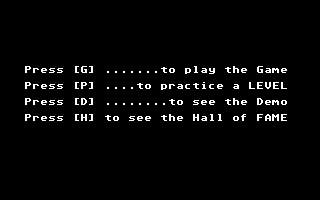
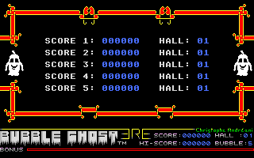
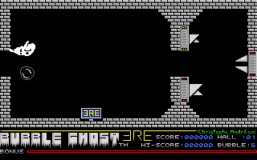
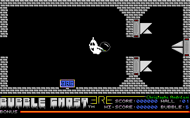
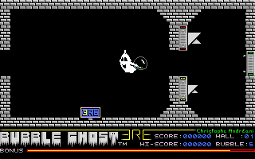
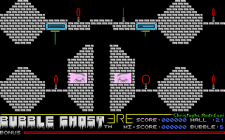
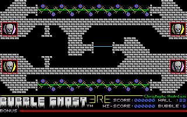

# Bubble Ghost (ERE Informatique, 1987 / Accolade, 1988) — Atari ST

A ghost blows a fragile bubble through the rooms of a castle, past candles, fans and spikes; the
title picture signs it *by C.Andreani* over *Copyright 1988, ACCOLADE INC. TM*. One 61 KB
`GHOST.PRG` plus six data files on a single-sided floppy, written in **Alcyon/DRI C, small model**.

**Status: fully named, every named function reconstructed and verified, and the reconstruction
BOOTS ON A 68000.** The shipped executable was decrypted statically, the copy protection is
understood and passes under Hatari, the graphics and speech are decoded out of the data files, and
the whole program has been read — **132 of its 134 functions named, 203 globals, 161 plate
comments** in `names.txt`. `recreate/` holds the C reconstruction: **all 132 of those functions are
green under the differential harness**, byte-for-byte against the original 68000 code, across
**1,909 tests**. [`recreate/STATUS.md`](recreate/STATUS.md) is the per-function ledger and says what
the harness can and cannot see; what is left is `GHOST.LOA` — a second program with no address in
this one — and five small regions of the two top-level routines that no slice may include.

**And it runs.** [`recreate/atari/`](recreate/atari/README.md) compiles those cores unmodified into
`BUBBLE.PRG`, which boots TOS 1.04 under Hatari through the crt0, the GEM workstation, the six data
files, the digitised speech, the presentation picture, the sprite bank and the sound driver, and
draws the game's own menu — **byte-identical to the original's**, all 32,000 framebuffer bytes,
measured against a dump of the shipped binary at the same point — **both sides photographed at the
same instruction**, ours at the shim's anchor and the original's at the slice boundary right after
it draws the same menu. `atari/smoke.py` is the gate: nine checks over the six surfaces of
[`docs/on-target-execution.md`](../../docs/on-target-execution.md), with **three negative controls**
(a colour register, a word of the staged program, the Timer C vector) each naming the surfaces it
must redden, plus a bootable 720 KB floppy whose boot to the TOS desktop is checked too, plus a
`game` mode that presses the menu's own `G` and `1` and watches the room loop turn behind them.
**The game itself is play-tested by a person, not by a check**: it is played with the mouse and
Hatari's headless control protocol has no mouse motion of any kind. The author played the `play`
build from `atari/disk/BUBBLE.ST` under Hatari on 2026-09-06 and reports it plays well (an earlier
report of the game dropping to TOS on `G` predates the XBIOS door and did not recur). Nothing here
has run on real hardware.

**And it runs at the original's speed.** `atari/profile.py` opens Hatari's CPU profiler at the first
`game_frame_update` on both binaries and closes it 1000 vertical blanks later: **468.5K cycles a
frame, 17.12 fps, against the shipped binary's 466.9K and 17.18 — x1.0034, which is inside this
instrument's own ~0.3% spread**. The first measurement was 809.2K (9.91 fps, x1.73); twelve waves
took it down, ending with two hand-written 68000 twins — the shim's GEM door and the 200 Hz sound
tick — that the differential pins against the C they replace. The game's mouse latency is one frame
time, because the room loop has no `Vsync` in it at all: it runs as fast as it draws, on the
original as much as here.

> No game data is in this repository. `bin/` and `out/` are gitignored; bring your own disk.

## Gallery

**Every picture here was drawn by `BUBBLE.PRG` on a 68000** — the reconstruction's own framebuffer,
`savebin`ned out of Hatari at a named instruction and decoded by `tools/st_pixels.py`, not a
screenshot and not a decode of a data file. [`recreate/atari/showcase.py`](recreate/atari/README.md)
is the whole recipe: four boots of the `play` build, each driven by the game's own keys, each moment
chosen as *an arrival count at one of the reconstruction's functions* rather than as a delay — so a
caption names a place in the program and not a wall clock. It asserts that no picture holds a single
colour, that the two demo frames are different moments and the two room frames different pictures,
and it stores every deterministic picture's sha256 and refuses the next run if one moves.

| The presentation | The menu | The hall of fame |
|:---:|:---:|:---:|
|  |  |  |

`GHOST.PRE` as the reconstruction unpacks and draws it, photographed at the instruction that hands
control to `GHOST.LOA` and starts the digitised speech — which is the moment the presentation's own
palette has to be on the chip, and the surface the XBIOS door was built for: before that door
existed a person watched this picture in the *desktop's* colours for the whole length of the voice.
The menu is taken at `menu_read_key_and_fold`, the read that blocks on those four keys, which is the
same place `smoke.py` photographs the shipped binary — and all 32,000 bytes of the two agree. The
hall of fame is `[H]`: the five `SCORE` rows drawn over room 0 as a backdrop, photographed at the
idle loop's first animation step, which is the first instruction after the table, the backdrop and
the HUD row are all on the visible screen.

| `[D]`, record 400 of the demo | …and record 720 | Room 1, one frame after `[G] [1]` |
|:---:|:---:|:---:|
|  |  |  |

The attract mode's first phase replays `GHOST.DEM` into room 1 — 980 six-byte records fed one per
drawn frame — and these are two of them, chosen by their arrival count so that the pair is the same
pair on every run. There is **no `Vsync` in that loop**: it runs as fast as the renderer does, which
is why the moment is a record number and could not be a delay. The script asserts the ghost is in a
different place in the two, so the later one cannot be the earlier one photographed twice. The third
is the game itself: `[G]` then `[1]`, one whole room frame in — the first moment the ghost and the
bubble have been through the GEM door onto the visible screen, and the moment `smoke.py game`
compares against the original's own room, byte for byte.

| 90 frames into room 1 | The slideshow, room 21 | …and room 33 |
|:---:|:---:|:---:|
|  |  |  |

The first is the same room 88 frames later, and what has moved in it is the fans, the ghost's own
animation and the bonus bar — **not the bubble**, which nothing blows while the mouse is still.
Hatari's headless protocol has no mouse motion of any kind, which is the same reason the game as a
game is play-tested by a person rather than by a check; poking a position into the game's own mouse
globals each frame *does* move the ghost and a held shift key *does* put it into its blowing pose,
but neither moved the bubble — the three runs and the coordinates they read back are recorded in
[`recreate/atari/README.md`](recreate/atari/README.md) — so no picture here claims a played frame.
The last two are the attract mode's second phase, a slideshow of 5..15 rooms picked by XBIOS
`Random` — **the one pair here that two runs cannot agree on**, since the seed is the clock: the
script publishes the first two candidates that drew *different* rooms and reads the room off
`A_room_number` at the same instruction as the picture, so these two captions name the rooms of the
run that made these two files rather than promising a room. A re-run replaces both, and a caption
left behind by one is visible in the picture itself: the HUD row along the bottom of every room
carries that room's own number. Room 35 can never appear, for the truncation reason in
[`notes/frontend.md`](notes/frontend.md) §2.

## Performance

The headline is the status paragraph above. The instrument, the twelve waves, the full per-routine
table and the four things the profiler cannot see are in
[`recreate/atari/README.md`](recreate/atari/README.md) ("Performance") and
[`recreate/STATUS.md`](recreate/STATUS.md) ("Performance — the baseline, and the twelve waves
measured on top of it"), and are not restated here.

## The disk

| file | bytes | what it is |
|---|---:|---|
| `GHOST.PRG` | 61,032 | the game, wrapped in a disk-protection **encrypter** (below) |
| `GHOST.LOA` | 2,703 | a standalone MFP Timer A **sample player**, loaded as data and `jsr`ed |
| `GHOST.VOI` | 30,100 | the sample it plays: the "Welcome to Bubble Ghost" speech, 14,985 Hz |
| `GHOST.DAT` | 184,352 | the tile bank — 360 × 512 bytes + a 32-byte palette |
| `GHOST.PRE` | 30,752 | the presentation screen — 60 × 512 bytes + a 32-byte palette |
| `GHOST.DEM` | 6,000 | the attract-mode recording: 1,000 records of 6 bytes |
| `DESKTOP.INF` | — | French desktop settings; **no autostart line, and no AUTO folder** |

`GHOST.SCR` is not on the disk: the game creates it on A: the first time it saves the hall of
fame. Every filename carries an explicit `A:` prefix except `GHOST.LOA`/`GHOST.VOI`, which are
built byte by byte at run time and load from the current drive.

## The wrapper is a cipher, not a cruncher

`GHOST.PRG` is the *same size* as the program inside it. Its five-word entry stub jumps into the
tail of the DATA segment, where a 262-word `eor` loop decrypts the wrapper's own second half — and
the first word it writes is the loop's own `dbf` displacement, which the 68000 has **already
prefetched**, so pass one branches to the stale target and runs a fixup tail that ones-complements
the key table. The unpacked code then `Floprd`s **track 79** of drive A: (sectors 245–247, fuzzy
bits and bad CRCs), CRCs what it read, CRCs the wrapper's own last 632 bytes with that as the
polynomial, and uses the 16-bit result as the key of a stream cipher over the whole program —
`plain[i+1] = cipher[i+1] ^ plain[i] ^ SR ^ k[i]`, with the CPU's **own condition codes** in the
keystream. So the check is not a branch anyone can patch out: get the disk wrong and you get
rubbish, not a failed test. The key (`0x586b`) fell to an exhaustive search over all 65,536
values, scored on whether the plaintext looks like a program. Layer-by-layer disassembly in
[`notes/loader.md`](notes/loader.md); general lessons in
[`docs/packed-executables.md`](../../docs/packed-executables.md).

## Reproduce it

```bash
# 1. decrypt the shipped executable (statically — no emulator, no disk)
python3 ../../tools/depack_bubbleghost.py bin/GHOST.PRG -o bin/GHOST_PLAIN.PRG
#    61032 packed -> 60391 bytes: text 0xe8ca, data 0x2f4, bss 0x6650, 9 relocations

# 2. Ghidra: one bootstrap, then the naming loop
bash run.sh                  # RE-IMPORTS AND WIPES NAMES — first bootstrap only
#    rewrites GHOST_PLAIN.PRG -> bin/GHOST_RT.PRG (run-time layout), pins a4, seeds 0x16d8e
bash reapply.sh              # the naming loop: names.txt -> DB -> decomp.c (on GHOST_RT.PRG)

# 3. prove the protection, and the static decrypter, on a real CPU
python3 tools/boot_ghost.py  # headless Hatari, TOS 1.04, the Pasti dump in A:

# 4. decode the data files (needs Pillow; output to out/assets/, gitignored)
python3 tools/extract_gfx.py && python3 tools/extract_audio.py

# 5. the reconstruction harness (image-model + constants tests)
make -C recreate test
```

**Why the relayout.** The Alcyon/DRI C crt0 moves the DATA segment *above* the BSS before
anything else runs and parks `a4` on the boundary, so the file layout `[TEXT][DATA][BSS]` is not
the layout the program executes in and every global is reached as `n(a4)`: in file layout the
decompiler showed **10,031 `a4 + n` expressions and no global had an address** for a `var` line
to name. The rebuilt `[TEXT][BSS][DATA]` image with `a4` pinned leaves **0 of them, and 8,166
globals resolved to their run-time addresses**. Recipe:
[`docs/ghidra-pipeline.md`](../../docs/ghidra-pipeline.md), "Small-model C".

`boot_ghost.py`'s gate is **not the picture**: it passes only when the whole TEXT
`depack_bubbleghost.py` produced statically is found byte for byte in the emulated machine's RAM
(the nine relocated longwords excepted), with a clean Hatari log, exit status 0 and a non-blank
capture — answering "does the protection pass under Hatari" and "is the static decrypter right"
at once. Starting the game from a GEMDOS C: is legitimate here because the protection addresses
drive A: **by device number**, so the `.stx` and its fuzzy bits stay where the check looks.

## The data files

`GHOST.PRE` and `GHOST.DAT` are the **same format**: 32×32-pixel tiles, 512 bytes each (32 rows
of two word-interleaved low-res groups), back to back with no header or index, and a 16-entry
`$0RGB` palette at the end. `GHOST.PRE`'s 60 tiles are the title screen in row-major order, 10
across by 6 down = 320×192 — eight scan lines short of a full ST screen. The layout was found by a
stride sweep and pinned by a seam test; every "obvious" 320×192 reading renders as striped noise.

**`GHOST.DAT` is described two ways in the notes, and they are the same bytes** — six 30,720-byte
buffers off the loader (`load_level_pictures` `malloc`s six `0x7800` blocks and a `0x20` palette)
and 360 tiles of 32×32 off the pixels. 6 × 30,720 = 360 × 512, and **the code settles it**: the
game fetches tile *n* as `dat_bank[n / 60] + (n % 60) * 512`, one 360-tile bank read in six
pieces. The room maps are 5×10 word grids of those indices, in the 36-record `room_table`
(`0x21a4a`).

`GHOST.VOI` is raw unsigned 8-bit PCM, one 2.0 s phrase, played by `GHOST.LOA` through the PSG's
three volume registers at 14,985 Hz. `GHOST.DEM` is 1,000 six-byte records of recorded *object
state* — `(ghost_x/3, ghost_y/2, ghost_tile, bubble_x/3, bubble_y/2, bubble_frame)`, confirmed
against the demo player: one record per drawn frame, 980 of the 1,000 replayed, no `Vsync` in the
loop. Formats and evidence: [`notes/assets_survey.md`](notes/assets_survey.md).

## What is next

The naming loop is done — **132 of 134 functions, 203 globals, 161 plate comments** — and so is the
port: every one of those 132 is verified byte-for-byte against the original, in **1,909 tests**.
Ghidra decompiled 123 of the 134; the 11 failures are all Alcyon C runtime, read out of the
disassembly. [`recreate/README.md`](recreate/README.md) has the image model and the procedure;
[`recreate/STATUS.md`](recreate/STATUS.md) has the ledger, the residuals and the kit's remaining
model gaps.

**What is left is two things, and neither is a function of this program:**

1. **`GHOST.LOA`** — the standalone MFP Timer A sample player, loaded as data and `jsr`ed. It is a
   second program with no address in this one; the two game routines that load and arm it are
   verified, and the LOA's own code is not. It programs a timer, busy-waits on a flag its own
   interrupt handler sets, and arms the cartridge DAC — none of which the kit models.
2. **A staged console stream the keyboard flush does not drain.** Every key this game reads it reads
   as `while (Cconis()) Crawcin(); c = Cnecin();`, and the model's console is one queue the flush
   empties — so no run can cross a flush into the blocking read behind it, and the whole front end
   is verified as regions that each END at one. STATUS.md's "Model gaps" says what closing it needs.

**The XBIOS group's seam is CLOSED** (2026-09-06) and is worth reading as a worked example rather
than as a gap. `Setscreen`, `Setpalette`, `Setcolor` and `Vsync` were swallowed INSIDE a verified
core with no `os_*` door under them, so the target build could only reissue two of them a slice late
and not the other two at all — and a person watching the presentation saw the cost: it played its
whole digitised voice in the desktop's palette. The kit now has doors for the group
([`TRAP_MODEL.md`](../../tools/recreate_kit/TRAP_MODEL.md), Phase 14), each an ordered entry in the
off-image OS event ledger with no image effect, and the first run of them found **three `Setcolor`
calls that were not in the reconstruction at all**.

**What still has no discharge but a person** is playing the game: Hatari's headless control protocol
has no mouse motion of any kind and Bubble Ghost is played with the mouse. `atari/smoke.py game`
presses the menu's own keys and judges the room loop behind them; `atari/run.sh` is the rest.

The game is remarkably OS-friendly for 1987 — a **GEM application**: text, the bonus bar and every
32×32 sprite blit go through the **VDI** (`trap #2`, `d0 = 0x73`), the input is the **mouse**
(`vq_mouse` for position and facing, `vq_key_s` for the Shift-key blow), XBIOS carries the screen
base and the palette, GEMDOS the files and the menu keys, there is no Line-A, and `$ffff8800` plus
`$fffffa17` are the only hardware addresses in the image. That is what the port turned out to be
dominated by: drawing code rather than hardware banging, and teaching the kit the VDI — sixteen
entry points, an ST raster and `vro_cpyfm`'s sixteen logic operations. Everything the asset survey left
open is answered at the end of [`notes/assets_survey.md`](notes/assets_survey.md), with the bodies
read in [`notes/frontend.md`](notes/frontend.md), [`notes/gameplay.md`](notes/gameplay.md) and
[`notes/sound_engine.md`](notes/sound_engine.md).

`names.txt` is the source of truth for every name; its addresses are Ghidra addresses at load base `0x10000` (= image offset + `0x10000`).
