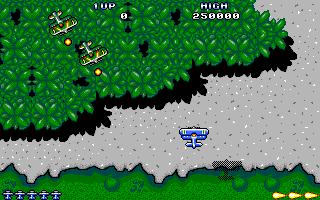
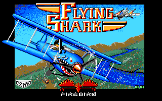
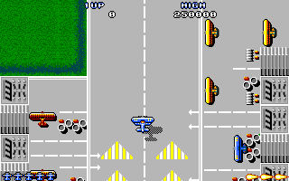
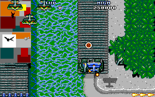
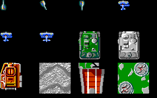

# Flying Shark (Taito 1987 / Firebird 1988) — Atari ST

Taito's vertically-scrolling shooter: one biplane over a jungle, a river, a carrier and whatever
else the map scrolls past, converted for the ST by **Prime Software & Images Design** — the payload
says so in its first 48 bytes, and the attract screen credits *HENRY S CLARK AND KARL D JEFFERY ·
GRAPHICS BY JASON G LIHOU · SOUND BY J C BROOKE*. Hand-written 68000: 50 KB of program, 1,563
relocations, eight files off disc, no compiler anywhere near it. The copy analysed here is not the
floppy release but **"PP"'s Gamex hard-disk install**, in which the game is a packed stream hidden
in the DATA of a stub that fakes GEMDOS out of one 600 KB blob — so step 0 was getting the real
program out and proving it still runs. It does.

| Level 1, flown by the reconstruction | The title picture, as the original's own loader left it |
|:---:|:---:|
|  |  |

**Status: named and reconstructed.** 254 functions named in [`names.txt`](names.txt); all ten
subsystems rewritten as C and **verified byte-for-byte against the original 68000 code**. The
pictures above and below are **drawn by that C**, not screenshotted:
[`gen_readme_assets.py`](gen_readme_assets.py) starts level 1 the way the game does and then plays
it with the reconstruction's own frame loop — one call into `frame_loop_once` per frame. There is no
playable `.PRG` yet: that waits on an on-target build rather than on more porting (below).

> **No game data is in this repository.** `bin/` and `out/` are gitignored; bring your own copy of
> the release.

## The distribution, and the game inside it

| File | Size | What it is |
|---|---:|---|
| `FILES/FSLA` | 24,790 | **stub + the packed game.** TEXT `0x698` is the GEMDOS-serving wrapper; DATA is one Gamex-LZ stream at `0x6d4` |
| `FILES/FRD` | 600,440 | **the game's data** — 21 files concatenated with no headers; the stub's own directory holds the offsets |
| `FILES/D15RU.FIC` | 65,943 | Gamex-LZ packed mini-OS the loader installs — wrapper |
| `RUNME.TOS` | 3,566 | Gamex-LZ packed loader — wrapper |
| `FFS273.HST`, `LFS273.HST`, `HAGA`, `FS240R.BMP` | | Gamex runtime, hardware-detect data, cover scan — wrapper |
| `README.TXT`, `LOG.TXT` | | the release's own notes, by "PP" |

[`tools/unpack_dist.py`](tools/unpack_dist.py) writes, alongside them: **`FLYSHARK.PRG`** — the game,
50,358 B, `text=0x59f4 data=0x6442 bss=0x3f0a8`, **1,563 relocations** — plus `RUNME_PLAIN.PRG` and
`GOS.PRG` (the depacked wrappers, for the record) and `disk/`, a folder TOS boots the game from:
`AUTO/FLYSHARK.PRG`, and the container's 21 files in `A/`, which is the relative path the game
itself asks for. The anatomy of all three wrapper layers is in
[`notes/loader.md`](notes/loader.md).

## Run it, and reproduce the analysis

```bash
python3 tools/unpack_dist.py     # depack + split the container; prints the manifest
/Users/geogeo/miniconda3/envs/atari_reverse/bin/python -m pytest tools/   # pin the directory + digest

bash run.sh                      # import FLYSHARK.PRG -> analyze -> annotate -> decomp.c
bash reapply.sh                  # the naming loop: names.txt -> Ghidra DB -> decomp.c

python3 tools/boot_shots.py      # boot bin/disk under Hatari (TOS 1.04) -> out/boot/*.png
python3 tools/extract_assets.py  # title, palettes, sprites, tiles, whole levels -> out/assets/
python3 tools/extract_audio.py   # every tune and effect, as .ym and .wav -> out/audio/

cd recreate && rm -f build/*.so && make test    # the differential suite
.venv/bin/python ../gen_readme_assets.py        # the pictures on this page, from the C cores
```

**The extracted game plays under Hatari with no Gamex runtime at all**: the title screen with 15 of
15 of `FLY_SHK.NEO`'s palette colours on screen, then the attract cycle — credits and HALL OF FAME
over a live scrolling level 1 (`out/boot/`). Input is untested; a joystick cannot be pressed
headless.

## The reconstruction

[`recreate/`](recreate/README.md) rewrites the game as readable C, each routine **diffed against the
original 68000 code** by the shared harness in [`tools/recreate_kit`](../../tools/recreate_kit): a
Musashi oracle runs the real instructions, the compiled C runs on a copy of the same flat memory
image, and every byte, register and OS call is compared.

| key | value |
|---|---|
| binary | `bin/FLYSHARK.PRG`, a plain GEMDOS `.PRG` — nothing packed once it is out of the container |
| load base | `0x10000` (the workspace default; every address in `names.txt` is at this base) |
| TOS surface | GEMDOS `Super`/`Fopen`/`Fread`/`Fclose`/`Cconout`, BIOS `Bconout`, XBIOS `Setscreen`/`Setpalette`/`Physbase`/`Kbdvbase`/`Vsync` — nothing else |
| heap | the game never allocates — `project.toml` waives the kit's arena with a byte scan, and `test_heap_guard.py` drives the run-time half |

The one thing that is unusual here is the **image model**. Flying Shark loads eight files before its
frame loop starts and derives its screen pointers from `Physbase`, so the `.PRG` as loaded is not a
machine any frame-loop routine runs on. `recreate/test/conftest.py` builds that machine by
**replaying three slices of the game's own boot code under the oracle** — not by transcribing it —
and an autouse fixture installs the result as the memory every differential starts from. The hand
transcription it replaced is kept as a second opinion and diffed against the replay over the whole
image; it has already been the side that was wrong.

| subsystem | verified rows | what it covers |
|---|---:|---|
| `sprite` | 20 | `render_frame` and everything that draws: twelve masked blitters over one body, the restore blitters, the tile band, the ring flip |
| `entity` | 39 | the 91-slot enemy arena — movers, the group publishers, the big-object depth model, power-up items |
| `player` | 29 | the plane: input, movement, the bank table, the take-off and fly-off scripts, both collision passes |
| `weapons` | 89 | the spawn script, player and enemy bullets, bombs and the blast, turret aiming, muzzle flashes |
| `hud` | 41 | score and hi-score BCD, the digit rows, bomb and life icons, the hall of fame, the cheats, the debug console |
| `sound` | 30 | the `MODULE.BAK` driver's sequencer, ported from the module's own 68000 |
| `init` | 13 | the boot chain, the file loader, the palettes, the two resets and one whole pass of the frame loop |
| `frontend` | 6 | the asset loader's filename patch, the attract screen's stage start, level 2's scenery band, the hall of fame |
| `scroll` | 5 | the frame loop's scroll step, and what a stage start does to the map cursor and to the screen |
| `irq` | 5 | the VBL handler, the IKBD ACIA handler and its two joystick continuations, TOS's displaced joyvec callback |

At the last measurement recorded in [`recreate/STATUS.md`](recreate/STATUS.md) that is **277 verified
rows across 3,553 tests, no skips**, with `make guarded` reporting 10,804 guarded candidate runs —
every case whose candidate indexes the image with an address it computed. STATUS.md re-derives the
total from its own rows (`test_status.py` refuses a literal grand total in its header), so read it
there rather than trusting this sentence.

### The frame loop already runs

`main` @ 0x15750 is three init calls and then a body of **forty-five `bsr`s and a closing `clr.w`,
forever**. The whole of that body is ONE verified core — `frame_loop_once` @ 0x1575c — so
[`gen_readme_assets.py`](gen_readme_assets.py) makes exactly one call into the reconstruction per
frame to draw the pictures on this page: the level is started by the original under the oracle
(`init_stage_state` → `start_level`, stopping one instruction before its tail-call into the sound
module), and then played frame by frame by the C. Not one pixel comes from the original, and now by
construction rather than by inspection.

| Take-off, frame 48 | Over the jungle | Over the carrier |
|:---:|:---:|:---:|
|  |  |  |

Two things make those pictures checkable rather than decorative. The frame each one is taken at is
**searched for, not typed** — the run plays on until the display list carries a stated number of
live records and refuses to publish if it never does — and the whole set is rendered twice per run
and refused if the two renderings differ, so nothing on the path may read a clock. The flight is
flown with the game's own **`HSC` invulnerability cheat** armed, which is `hud.c`'s verified core:
the death path branches into `restart_level_at_checkpoint`, whose tail has no core and which never
RETURNS — it ends `bra.w $1575c`, back to the frame loop's own top, unwinding the stack — so a run
that let the plane die would keep playing frames no machine ever plays. (Measured: with the cheat
off, this joystick script loses the plane on frame 194.) The run asserts the plane never leaves a
flying mode, so that seam cannot quietly stop holding.

## Assets and audio

[`tools/extract_assets.py`](tools/extract_assets.py) decodes every graphic in the game out of
`bin/disk/A/` and the `.PRG`, and each format is confirmed by rendering it in the palette the game
installs, not by guessing at a header ([`notes/assets_survey.md`](notes/assets_survey.md)):

| out/assets/ | what |
|---|---|
| `title.png` | `FLY_SHK.NEO` — an unmodified NEOchrome file, header and all |
| `sprites/`, `sprites_sheet.png`, `sprites_index.tsv` | **218 rendered sprites** of the 230 records `SPRITES.CRU` uses; the other 12 hold only a hit box |
| `tiles/bank_0..C.png` | **13 tile banks**, 64 tiles of 32×32 each; four are resident at a time, which is why there are thirteen for five levels |
| `levels/level_1..5.png` | **all five maps rendered whole**, base tile with its overlay over it, the level's start at the top — 320 × up to 7,392 pixels |
| `palettes/` + `palettes.txt` | the four sixteen-colour rows the game installs, as swatches and as words |

| The four masked blitters, drawing twelve sprite records |
|:---:|
|  |

That sheet is not from the extractor: it is drawn by `recreate/src/sprite.c`'s own
`sprite_blit_w16`/`w32`/`w48`/`w64` onto a cleared screen, three records of each width class, so all
four blitters run.

[`tools/extract_audio.py`](tools/extract_audio.py) captures **5 tunes and 13 sound effects** as
`.ym` and `.wav` by running the original `MODULE.BAK` driver under the same Musashi oracle and
logging its YM2149 writes — including the loop points, and including effect 12, which **no call site
in the game can start** ([`notes/sound_engine.md`](notes/sound_engine.md)).

## What the work turned up

* **The screen is why the program has to live in `AUTO\`.** `boot_init` calls
  `Setscreen(log=$70000, phys=$78000)` unconditionally and then builds a `0x1f900`-byte circular
  framebuffer *downwards* from `Physbase` to **`$58800`**. Nothing about that adapts to where the
  program was loaded, so the game survives only if its TEXT lands at or below **`$d922`**. TOS's own
  `AUTO\` scan gives it `$aa56` and it plays; started from the desktop it gets `$12596`, and its own
  scroll ring overwrites the music driver it loaded a second earlier — an illegal instruction at
  `$5b004`, measured, with the corrupted span matching `MODULE.BAK` file offsets `0x142`–`0x161`
  byte for byte. ([`notes/loader.md`](notes/loader.md), "Where the screen lives")
* **The sound module overlaps the entity arena by nine bytes.** `A\MODULE.BAK` loads to
  `0x58928..0x5998d` and the 91-slot enemy arena starts at `0x59984`. The game is unaffected —
  `clear_actor_arrays` zeroes those bytes at every new game, and they are the tail of sound effect
  **12**, which nothing ever plays — but a tool reading the module's tables out of a post-load image
  gets a record the game cannot reach. Pinned by name, so an arena that moves fails loudly.
* **This `.PRG` is a patched single-disc build.** Six sites had their leading word or byte
  overwritten so the game never asks for a disc swap, and in every case the *tail* of the original
  instruction is still in the file and decodes exactly — which is what makes it a finding rather
  than a hunch. ([`notes/frontend.md`](notes/frontend.md) §3)
* **Six cheats, and they are the developers' own initials** — `HSC`, `KDJ`, `JGL`, `GCC`, `J H`
  match the credits screen. Entered as hall-of-fame initials with the keypad `4` held down, they
  give invulnerability, infinite lives, infinite bombs, an alternate projectile glyph and a maxed
  weapon. `JML` is a booby trap: `movea.l #0,a0 / jsr (a0)`. Entering `HSC` a *second* time kills
  you. All five real ones are ported and verified. ([`notes/frontend.md`](notes/frontend.md) §6)
* **Original bugs, reproduced and not repaired.** The right-edge clip ladders of sprite width
  classes 0 and 1 narrow the restore record they just appended and those of classes 2 and 3 do not,
  so a clipped 48-pixel sprite restores 16 bytes past the row's end into the row below.
  `render_frame`'s map-pointer reset arm is dead twice over — `0x147da` is a `nop` where the bound
  test was, and the store it guarded is overwritten two instructions later. `build_text_display_list`
  reads a word out of **absolute address `0x40`**, in the 68000 vector page, not this program's
  data. `player_bullets_move_group` steps a *free* slot's coordinates too. Each is transcribed as
  the instruction it is, with a test that would go red if it were quietly fixed.
* **The container's `Fopen` skips two characters of every name** — the `A\` — which is the tell that
  told us a plain folder with an `A` subdirectory is all the game needs, and is why the Gamex
  runtime could be thrown away entirely rather than emulated.
* **The music driver's base is `+28`, not the file's start.** `MODULE.BAK` is a position-independent
  `.PRG` loaded whole, header included, and the game adds the 28-byte header itself at all fourteen
  call sites. Confirmed the hard way: at the file's own base, offset 38 lands mid-word.
* **Dead data nobody reads.** `easter_egg_scancodes` — fourteen ST scancodes spelling a rude message
  about a colleague — sits immediately above the eight-entry key-watch table; the ISR stops at eight
  and no instruction anywhere names it.

## Status, and what is next

* **Done.** The distribution is unpacked and pinned by a test; the game runs from a plain folder
  under TOS 1.04; 254 functions named; all ten subsystems reconstructed and verified; every graphic
  and every tune extracted; the frame loop runs end to end on the reconstruction's own C.
* **Left in the ledger.** Not subsystems, but six rows in
  [`recreate/STATUS.md`](recreate/STATUS.md)'s "Not reconstructed": two model blockers (the boot
  slice needs the kit to stage eight files in one window rather than seven), three routines whose
  own shape has no checkpoint a slice could stop at (the title flow's spin loops), and two pieces of
  dead code.
* **Not built.** A playable `.PRG`, which waits on the ON-TARGET BUILD rather than on more porting:
  the game hangs its screen ring 0x1f900 bytes below whatever `Physbase` answers and hard-codes
  nothing about where that is, so a `.PRG` needs either an `AUTO\` launch or a low-load stub to get
  the ring to `$58800` — plus real `Kbdvbase()` and `Physbase()` doors behind
  `recreate/include/init.h`'s two seams, since neither answer is an offset into the modeled image.
  And a real `.ST` floppy:
  `tools/st_build.py` writes one hard-coded `AUTO\`, and this disk needs *two* directories —
  `AUTO\FLYSHARK.PRG` and `A\` with the 21 data files (650,798 bytes, which does fit a 728,064-byte
  volume). Nothing has run on real hardware.

## Notes

[`notes/loader.md`](notes/loader.md) — the three wrapper layers, the stub's GEMDOS implementation,
the reference Hatari run and where the screen lives ·
[`notes/frontend.md`](notes/frontend.md) — boot chain, framebuffer model, file protocol, interrupts,
front-end flows, the cheats ·
[`notes/gameplay.md`](notes/gameplay.md) — the 45-call frame loop, every record layout, the scroll
model, collision, the spawn script ·
[`notes/assets_survey.md`](notes/assets_survey.md) — the four on-disc formats, byte by byte ·
[`notes/sound_engine.md`](notes/sound_engine.md) — the module's ABI, music and effect formats, and
which game event plays what.

## Credits & legal

*Flying Shark* is Taito's 1987 coin-op; this is the licensed Atari ST conversion published by
Firebird in 1988, **programming by Prime Software & Images Design** — the string
`PROGRAMMING BY PRIME SOFTWARE & IMAGES DESIGN` is in the binary itself, and the attract screen
credits *HENRY S CLARK AND KARL D JEFFERY*, graphics *JASON G LIHOU*, sound *J C BROOKE*. The copy
analysed here is "PP"'s Gamex hard-disk release, whose own `README.TXT` and `LOG.TXT` are signed by
its author. All rights in the game and in the arcade original belong to their respective owners.

This directory contains **no game code or data** — no `FSLA`, no `FRD`, no `FLYSHARK.PRG`, none of
the 21 container files, no disk image and no TOS ROM. It holds analysis, documentation, tooling and
independently written C. The pictures on this page are output of that reconstruction, or of the
game's own data decoded by the tools here; reproducing any of them needs the files this repository
does not ship. Reverse engineering here is for interoperability, preservation and study.
